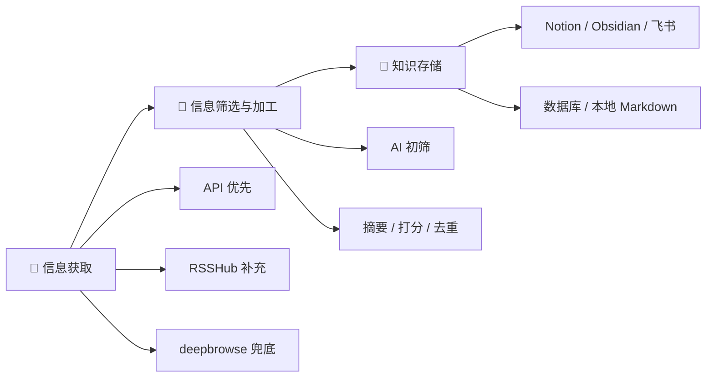
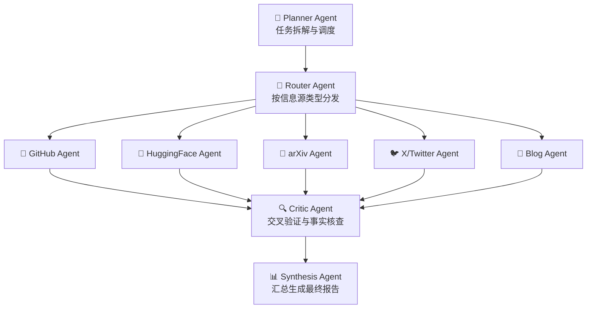

| **文档版本** | v1.0 |
| --- | --- |
| **产品名称** | LexDeepResearch |
| **负责人** | @黎 耀聪 |
| **创建日期** | 2026年3月1日 |
| **关联文档** | [LexDeepResearch沟通文档](https://www.notion.so/LexDeepResearch-2efe7e998fb280809ff4c59c150769b7?pvs=21) |

---

## 1 产品概述

### 1.1 产品定位

**LexDeepResearch = deepbrowse（API挖掘 + Skills） + lexmount** 

LexDeepResearch 是一款面向 AI 从业者和研究人员的 **自动化信息获取与深度研究产品**，旨在将分散在全球各平台的 AI 前沿资讯自动采集、智能筛选、结构化加工，并落盘至用户偏好的知识管理工具中。核心理念是 **让用户把注意力放在创造，而非信息获取**。

### 1.2 产品愿景

构建一个拥有 Web Dashboard 的智能信息中枢，用户可以：

- **自由选择信息源**：社交媒体、开源社区、学术平台、技术博客
- **自由选择落盘位置**：Notion、Obsidian、飞书文档、本地 Markdown 等
- **自由选择输出格式**：简洁日报、深度分析报告、研究综述等

### 1.3 核心亮点

1. **深度浏览能力（核心差异化）**：基于自研 deepbrowse 浏览器 Agent（详见 [TEC.md](./TEC.md)），可直接抓取无 API / 无 RSS 的信息源
2. **定时每日推送**：自动化信息采集与分发，无需人工触发
3. **输出格式多样**：从速览到深度报告的分层模板体系
4. **落盘路径多样**：适配主流知识管理工具，通用性强

### 1.4 MVP 范围说明

**MVP = 所有 P0 功能 + P1/P2/P3 骨架预留**。

- P0 功能完整实现并可端到端运行
- P1/P2/P3 在代码结构、DB Schema、API 接口层面预留扩展点，但不在 MVP 阶段实现
- MVP 的 Web 平台只需支持「查看采集结果」，完整 Dashboard 功能属于 P1

### 1.5 竞品对比

<aside>
⚡

对标产品：**yutori / scout**（网络内容监控产品）。LexDeepResearch 的核心护城河在于 **自研浏览器 Agent 能力（deepbrowse）**，可突破纯 RSS/API 方案的信息覆盖限制，这是竞品无法复制的关键差异点。

</aside>

---

## 2 使用场景

| **场景** | **描述** |
| --- | --- |
| 场景 1 | 用户选择每日推送 GitHub Trending 和 X 上 AI 相关的高价值内容，自动记录到 Notion |
| 场景 2 | 用户选择每日推送 arXiv 上 Web Agent 相关的论文深度分析报告，自动记录到 Obsidian |
| 场景 3 | 用户持续跟踪选定 AI 公司/研究团队（Anthropic、OpenAI、Seed、MiniMax…）的技术发展，自动记录到 Notion |

---

## 3 系统架构

产品核心流程分为三个阶段：

**数据量估算**：开源社区（GitHub Trending 等）约 10 条/天；各技术博客每源 1~2 条/天，30+ 博客源合计约 40~60 条/天；全部信息源汇总 **~50~80 条原始数据/天**。该量级对 LLM 调用成本和并行抓取压力均较低。

---

## 4 功能需求

### 4.1 信息获取模块

#### 4.1.1 信息源覆盖

| **类别** | **信息源** | **获取方式** | **优先级** |
| --- | --- | --- | --- |
| **开源社区** | GitHub Trending | GitHub MCP（主）+ 第三方 API / RSSHub（备） | `P0` 已实现 |
| **开源社区** | Hugging Face（模型、Daily Papers、Spaces） | 原生 API（`huggingface_hub`） | `P0` |
| **技术博客** | OpenAI、Anthropic、DeepMind、Meta AI、DeepSeek 等 30+ 厂商 | RSS 订阅（7 家）+ 自建爬虫脚本抓取（~20 家无 RSS 博客）+ deepbrowse 兜底 | `P0` |
| **学术平台** | arXiv | 官方 API（`pip install arxiv`），按分类 `cs.AI` / `cs.CL` / `cs.LG` 检索 | `P1` |
| **学术平台** | Semantic Scholar、OpenAlex | 免费学术 API | `P2` |
| **社交媒体** | X (Twitter) | deepbrowse 浏览器抓取（官方 API 已无免费方案） | `P1` |
| **社交媒体** | Reddit（r/LocalLLaMA 等） | 官方 API（PRAW）+ RSSHub 备选 | `P1` |
| **社交媒体** | LINUX DO | Discourse REST API（URL + `.json`） | `P2` |

<aside>
💡

**实施策略**：社交媒体反爬机制较强，且高质量内容大部分在官网 Blog 中有更详细版本。建议 **先做技术博客 + 开源社区**，再推进学术平台和社交媒体。

</aside>

#### 4.1.2 获取方式优先级

1. **API 优先**：使用信息源的原生 API（arXiv、Hugging Face、Reddit、LINUX DO 等）
2. **RSS 订阅**：对提供 RSS 的信息源直接订阅（OpenAI、DeepMind、Meta AI 等约 7 家）
3. **自建爬虫脚本**：对无 API 也无 RSS 的技术博客，直接编写爬虫脚本抓取网站内容（大部分技术博客页面结构相对稳定，可构造定向脚本高效获取），沉淀为可复用的抓取模块
4. **API 挖掘**：对部分隐藏接口的信息源，通过 API 挖掘发现并沉淀到内部 API 库
5. **deepbrowse 兜底**：对页面结构复杂、需要动态渲染或登录态的信息源，使用 deepbrowse 浏览器直接抓取

#### 4.1.3 信息源管理

- 系统预设一批优质信息源（见 4.1.1 表格）
- 用户可在 Dashboard 中新增/删除/启停信息源
- 支持 API 挖掘发现的新信息源持久化存储到 API 库

---

### 4.2 信息筛选与加工模块

采集到原始信息后，系统自动执行以下处理流水线：

**Step 1 — AI 初筛**

> 剔除"与 AI 无关"或"无报道价值"（如单纯使用教程）的内容
> 

**Step 2 — 并行加工（4 项任务同时执行）**

| **任务** | **描述** |
| --- | --- |
| **摘要生成** | AI 为每条信息制作 ≤50 字摘要，辅助人工快速判断 |
| **关键词提取** | 提取关键词（如 "Gemini 3"），将资讯归类到具体事件；已有关键词纳入上下文供 AI 参考 |
| **旧闻排除** | 与上一次日报及 72 小时内的历史内容比对，排除重复信息 |
| **智能打分** | AI 对信息价值打分，低于阈值自动排除，分值供人工参考 |

**Step 3 — 输出至信息池**

> 经过筛选和加工的信息进入信息池，等待输出或审核

> **注**：信息溯源与可信度标注（区分一手/二手信息、标注信息源层级）为 `P1` 功能，MVP 阶段暂不实现，但数据结构预留 `source_type` 字段。

 

---

### 4.3 输出模块 — 报告体系（二维分类法）

由于信息消费的场景多样化，我们将报告划分为两个维度进行组织：**时间跨度（Time）** 与 **研究深度（Depth）**。

#### 维度一：时间跨度 (Time Dimension)
| **周期** | **触发方式** | **说明** |
| --- | --- | --- |
| **日报 (Daily)** | 每日定时触发 | 高频信息跟踪，默认展现当日最新动态聚合。 |
| **周报 (Weekly)** | 每周定时触发 | 总结一周的核心趋势、重大进展与技术风向。 |
| **自定义时段** | 手动触发 | 用户针对某一特定时间区间发起的报告生成。 |

#### 维度二：研究深度 (Depth Dimension)
| **深度层级** | **处理方式** | **内容呈现与适用场景** |
| --- | --- | --- |
| **简报 (Briefing)** | **总结型** (TL;DR) | 追求快速阅读。对技术博客提取核心观点；对 GitHub 提供 README 核心特性浓缩；对论文提取摘要结论。适用于日常碎片化信息获取。 |
| **深研 (Deep Dive)** | **分析型** (Analysis) | 追求深度认知。对博客进行方法论拆解；对开源项目进行全文与架构级分析；对论文做包括背景设定、实验结果、评测维度的全篇精读。适用于硬核技术跟进与投资/研究调研。 |

**生成与切换规则：**
1. 默认展示**日报 (Daily) + 简报 (Briefing)**。
2. 同一份信息集合可以在不同维度间切换：通过改变深度，对当份日报的内容由“提供摘要”变为“提供深度分析文档”。

---

### 4.4 知识存储模块

#### 4.4.1 多端落盘

| **落盘位置** | **接入方式** | **备注** |
| --- | --- | --- |
| Notion | Notion MCP / Notion API / n8n | 已实现，当前主要落盘路径 |
| Obsidian | WebDAV API + Remotely Save 插件 | 架构最解耦方案。Linux端只负责推送到自建 WebDAV，Mac 端通过插件拉取，免去互相发现和组网配置。 |
| 飞书文档 | 飞书开放平台 API | 适配国内用户 |
| 本地 Markdown | 文件系统直接写入 | 最轻量方案 |
| 数据库 | 根据具体 DB 类型适配 | 结构化存储，支持查询 |

#### 4.4.2 模板系统

- 对所有落盘路径预设好文档模板，保证输出的可读性
- 支持用户自定义编辑模板，满足个性化排版需求

#### 4.4.3 长期知识维护

- 支持对知识文档进行**增量更新**，自动衔接上一次的内容
- 相当于一个持续运行的 Deep Research，而非每次从零开始

---

## 5 技术架构设计

### 5.1 多代理 Agent 集群 `P1`

- **Planner Agent**：接收用户配置，拆解任务分发给子代理
- **Router Agent**：根据信息源类型智能路由
- **子 Agent 集群**：GitHub Agent / HuggingFace Agent / arXiv Agent / X Agent / Blog Agent 等
- **Critic Agent**：负责交叉验证和事实核查，避免单一 Agent 偏差
- **Synthesis Agent**：汇总各子 Agent 结果，生成最终报告

### 5.2 知识图谱与事件追踪 `P2`

围绕 **"公司 → 模型 → 技术 → 事件"** 建立轻量知识图谱：

- **自动触发**：每次信息入库时，自动提取实体和关系，增量更新图谱
- **被动消费**：日报/周报/深度报告中自动插入关联信息卡片（"相关历史"侧栏）
- **主动查询**：用户可在 Dashboard 中搜索实体，查看完整事件时间线

**核心价值：**

1. 消除重复认知成本——自动附上历史脉络
2. 事件全链路追踪——预热 → 发布 → 评测 → 竞品对比 → 后续更新
3. 深度报告自动补全上下文——自动填充"背景与动机"和"竞品对比"

---

## 6 产品功能优先级

| **优先级** | **功能** | **说明** |
| --- | --- | --- |
| **P0** | 深度浏览能力（deepbrowse） | 核心差异化能力，突破纯 RSS/API 方案的信息覆盖限制 |
| **P0** | GitHub Trending + X 信息获取 | 已在 Notion Custom Agent 中实现，每日 07:00 定时运行 |
| **P0** | 技术博客 + 开源社区信息源接入 | 先做覆盖面最广、反爬最弱的信息源 |
| **P1** | 信息溯源与可信度标注 | 区分一手/二手信息，标注信息源层级 |
| **P1** | 输出格式分层设计（L1~L4） | 速览 / 日报 / 周报 / 深度报告四级模板体系 |
| **P1** | 多代理 Agent 集群 | Router + 子 Agent + Critic + Synthesis 架构 |
| **P1** | API 挖掘与信息源积累 | 持续发现优质信息源接口，沉淀到 API 库 |
| **P2** | 知识图谱与事件追踪 | 公司→模型→技术→事件的轻量知识图谱 |
| **P2** | 学术平台信息源接入 | arXiv、Semantic Scholar、OpenAlex |
| **P3** | 用户自定义关注领域 | 用户配置关注关键词，AI 辅助补充和确认 |
| **P3** | Human-in-the-Loop 审核工作流 | AI 筛选后生成"待审稿"视图，用户快速审核后发布 |

---

## 7 目标形态（Web Dashboard）

<aside>
🎯

### MVP 一期（P0）：最小可用 Web 平台

用户能够通过 Web 界面看到系统自动采集的结果及管理流程：

1. **Discover (发现)**：大盘首页。仅展示最新生成的 N 份（如 10 份）高优报告或资讯，作为日常快速消费的入口。
2. **Monitors (监控任务)**：核心配置区。用户在此创建和管理研究任务（选择时间维度如日报/周报，选择深浅维度如简报/深研，并绑定关心的信息源）。
3. **Library (知识库)**：完整数据库。提供对历史上所有已生成的报告、已拉取的原始资讯的无限制查询、筛选与检索功能。
4. **Sources (信息源大厅)**：全局资源池。展示系统当前支持接入的所有信源（按分类），并提供「新增信息源」的能力。这是全局的池子，而非针对某一具体任务。

---

**终态目标（P1+）：完整 Dashboard 增强**

- **落盘配置面板**：在 Monitors 中支持配置单任务定向输出到 Notion / Obsidian / 飞书
- **知识图谱浏览**：在 Library 中支持搜索实体、查看事件时间线和关联关系
- **审核工作流**：待审稿 Board 视图，供 Human-in-the-Loop 审核后发布
</aside>

---

## 8 风险与依赖

| **风险项** | **描述** | **缓解方案** |
| --- | --- | --- |
| 社交媒体反爬 | X 已无免费 API；Cloudflare Bot 检测拦截 | deepbrowse + lexmount 登录态功能；优先做技术博客内容 |
| 信息源 API 变更 | 第三方 API 政策或接口结构变化 | 多方案兜底（API → RSSHub → deepbrowse） |
| AI 筛选质量 | 初筛可能误判有价值/无价值内容 | Human-in-the-Loop 审核 + 长期反馈优化 |
| 并行抓取稳定性 | 高并行下 CDP 连接不稳定 | 控制并发数；连接池管理与重试机制 |
| 信息"幻觉" | AI 摘要可能偏离原文 | 信息溯源标注 + 原文链接 + 关键引用段落附注 |