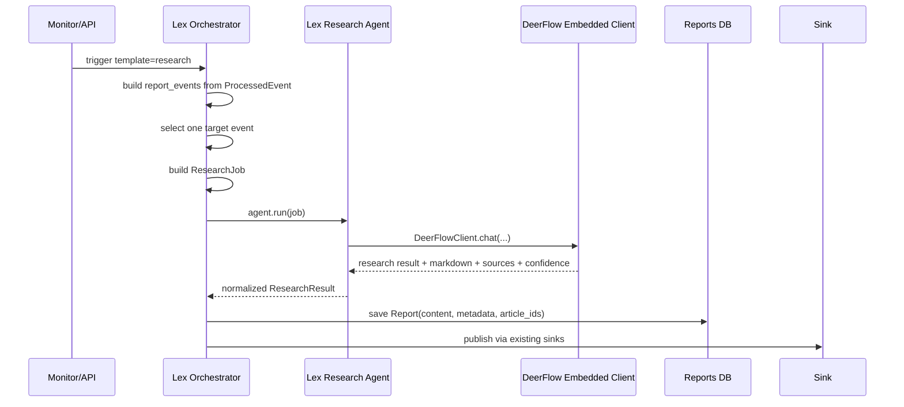

# LexDeepResearch x DeerFlow Integration Design

更新时间：2026-03-13

## 1. 文档目标

本文档定义 LexDeepResearch 接入 DeerFlow 的可执行设计。

目标不是用 DeerFlow 替换 LexDeepResearch，而是把 DeerFlow 作为 `Template=research` 的外部深研执行器接入现有系统。

本文档重点回答：

- DeerFlow 在 LexDeepResearch 中承担什么职责
- 当前代码下 `research` 链路的真实改造点是什么
- Lex 与 DeerFlow 的输入输出契约应该如何定义
- 首期应该如何在不影响 `daily / weekly` 主链的前提下落地

---

## 2. 基于当前代码的系统判断

基于当前仓库，LexDeepResearch 已具备完整的生产型信息系统骨架：

- 采集层：`collectors/*`
- 事件加工层：`processors/pipeline.py`、`candidate_cluster.py`、`event_extract.py`
- 调度层：`scheduler/orchestrator.py`
- 报告与存储层：`providers/*`、`models/report.py`、`sinks/*`
- 前端与 API：`api/v1/*`、`frontend/src/app/*`

### 2.1 已有强项

LexDeepResearch 当前更强的部分是：

- 多源采集与 fallback 收集
- monitor / run / task event 管理
- 文章级筛选与事件级结构化提炼
- report 入库与多 sink 发布

### 2.2 当前 `research` 路径的真实状态

当前需要明确 5 个代码事实：

1. `ProcessedEvent` 已经存在，字段足够支撑研究任务输入。
2. 当前代码仍以 `time_period + report_type` 表达“时间周期 + 报告类型”，尚未把 `Frequency` 和 `Template` 完全拆开。
3. `backend/app/renderers/deep_report.py` 仍是占位实现，不具备实际 L4 报告能力。
4. 当前 `orchestrator` 对 `daily / weekly / research` 共用同一条报告主链：先组装 `report_events`，再生成 `global_summary`，再生成 daily markdown，最后调用 `report` stage provider。
5. 当前内置 `llm_openai` report provider 只会重写标题与 `global_tldr`，不会生成新的深研正文。

因此，`research` 当前并不是“独立研究链路”，而是“现有 `report_type` 标签下的一条共用报告路径”。

### 2.3 当前缺口

当前 `research` 缺少真正的深研执行引擎：

- 没有独立的 `research` 报告正文生成链路
- 没有研究任务选择逻辑
- 没有 DeerFlow 这类外部 runtime 的稳定接入层
- 没有将 sources / confidence / artifacts 显式落到 `Report.metadata` 的统一契约

---

## 3. DeerFlow 的定位

DeerFlow 在本方案中的定位是：

> 面向单个研究任务的外部 Deep Research Runtime

它负责：

- 接收已经结构化的研究任务
- 围绕单个高价值事件做多轮检索、网页抓取、交叉验证、时间线重建
- 按固定结构输出高质量 Markdown 深研报告

它不负责：

- 替代 LexDeepResearch 的 collector 体系
- 替代 monitor、report、destination、publish 管理
- 直接成为主数据库或主前端
- 接管 `daily / weekly / custom` 的调度语义
- 参与当前 P0 的 filter / keywords / global_summary 主链

### 3.1 LexDeepResearch 负责

- 采集、抓取、预处理
- 时间窗过滤、去重、候选事件聚类
- 事件级结构化提炼
- 研究目标事件选择
- DeerFlow 任务调度、超时控制、降级处理
- 报告持久化、展示与发布

### 3.2 DeerFlow 负责

- 研究型 agent 编排
- 多轮网页搜索与全文抓取
- 基于输入证据继续验证和补充上下文
- 产出深研 Markdown、来源列表、置信度与附加 artifacts

---

## 4. Frequency 与 Template 解耦原则

### 4.1 目标模型

本方案采用以下抽象：

- `Frequency`：决定多久生成一次报告
- `Template`：决定报告长什么样、走哪条 report 渲染路径

推荐的目标语义为：

- `Frequency = daily / weekly / custom`
- `Template = brief / research / ...`

两者不应做强绑定。

### 4.2 为什么要解耦

如果强绑定，会出现这些限制：

- `research` 只能在 `custom` 下使用
- `daily` 只能产出简报
- `weekly` 不能做 research

这会直接限制产品组合能力，也会让 DeerFlow 和“时间频率”错误耦合。

正确做法应该是：

- `daily + brief`
- `daily + research`
- `weekly + brief`
- `weekly + research`
- `custom + research`

都应在模型层面合法。

### 4.3 与当前代码的兼容关系

当前代码现实仍然是：

- `time_period` 更接近 `Frequency`
- `report_type` 暂时承载了部分 `Template` 语义

因此，P0 设计层面先按“解耦原则”约束新方案，但落地时可以先兼容现有字段命名。

短期兼容策略：

- 调度仍主要看 `time_period`
- DeerFlow 路由选择看“是否为 research template”
- 即使底层字段名暂时还是 `report_type`，也不再把它解释成频率绑定的概念

---

## 5. P0 范围与非目标

### 5.1 P0 目标

当用户或 monitor 触发 `Template=research` 时：

1. LexDeepResearch 从已提炼的 `ProcessedEvent` 中选出一个研究目标事件。
2. LexDeepResearch 将该事件组装为标准 `ResearchJob`。
3. `backend/app/agents/` 中的 research agent runtime 调用 DeerFlow。
4. DeerFlow 返回结构化深研结果。
5. LexDeepResearch 将 Markdown 正文写入 `reports.content`，并把研究元数据写入 `reports.metadata`。
6. 现有 Database / Notion / Feishu sink 继续复用。
7. DeerFlow 失败时，本次 research report 直接失败，不做 fallback。

### 5.2 P0 约束

首期实现必须刻意收敛：

- 只支持“单事件 research”，不做多事件合并研究
- 只在 `Template=research` 路径引入 DeerFlow
- 不改 `daily / weekly` 主链
- 不要求前端首期做结构化 research 专属页面
- 不要求 DeerFlow 首期参与 `global_summary`

### 5.3 非目标

以下不在首期范围：

- 用 DeerFlow 替代 filter / keywords / event_extract / global_summary
- 让 DeerFlow 直接承担全量采集
- 一开始就做双向同步或深度耦合
- 一开始就支持“一个 research 报告研究多个事件”
- 一开始就重做前端信息架构

---

## 6. 总体架构

推荐架构如下：

```text
LexDeepResearch
  ├─ Collectors
  ├─ Processors
  ├─ Event Pool
  ├─ Orchestrator
  ├─ backend/app/agents
  │    ├─ base / schemas / registry
  │    └─ deerflow_embedded
  ├─ Report DB / Sinks / UI
  └─ DeerFlow Embedded Client
       └─ DeerFlowClient
            └─ lead_agent runtime
                 ├─ default enabled skill: event-deep-research
                 ├─ web_search / web_fetch / artifacts
                 └─ skills / MCP / sandbox
```

核心原则：

- LexDeepResearch 是主系统
- DeerFlow 是独立演进的 research runtime
- `research template` 走独立分支，不再复用 daily markdown 作为最终正文

---

## 7. `research template` 执行链路

### 7.1 新的 `Template=research` 流程



### 7.2 关键改造原则

`research template` 必须从当前共用报告链路中分出来：

- `daily / weekly` 保持现状
- `research` 不再依赖 `render_daily_report()` 生成最终正文
- `research` 不强依赖 `global_summary` 阶段
- DeerFlow 返回的 `content_markdown` 直接作为最终正文

### 7.3 推荐运行步骤

1. 现有 collect / filter / candidate_cluster / event_extract 链路照常执行。
2. `orchestrator` 基于 `ProcessedEvent` 组装 `report_events` 以供调试与日志使用。
3. 当选择 `Template=research` 时，执行独立的 research 分支。
4. 从事件列表中选择一个目标事件。
5. 组装 `ResearchJob`。
6. 从 `backend/app/agents/registry.py` 加载 research agent runtime。
7. 调用 `agent.run(job)`。
8. 成功时直接持久化 DeerFlow 结果；失败时 research task 直接失败。

---

## 8. 研究目标事件选择

### 8.1 为什么必须先定义选择规则

“研究什么”是整个集成的关键控制点。如果这一步不收敛：

- DeerFlow 成本不可控
- 输出质量不稳定
- 多事件输入会稀释研究深度
- failure 语义难以解释

### 8.2 P0 选择策略

P0 默认只选 `top 1` 事件进行研究。

推荐排序规则：

1. `importance`
2. `source_count`
3. `published_at`
4. `source_links` 是否存在可信来源

### 8.3 准入规则

事件进入 research 候选池至少满足：

- 至少有 1 个 `source_link`
- `title`、`summary`、`detail` 至少有 2 项非空
- `category` 不为空

若没有满足条件的事件：

- 不调用 DeerFlow
- research task 直接失败
- 在 run event 中记录失败原因

---

## 9. 研究任务模型

DeerFlow 的输入不应是“开放主题”，而应是“已知事件 + 明确研究问题”。

### 9.1 Lex -> DeerFlow 请求模型

```json
{
  "job_id": "uuid",
  "template": "research",
  "frequency": "daily",
  "agent_name": "deerflow_embedded",
  "language": "zh-CN",
  "event": {
    "event_id": "evt_123",
    "title": "OpenAI 发布新模型",
    "summary": "已有短摘要",
    "detail": "已有事件详情",
    "category": "模型发布",
    "importance": "high",
    "source_count": 3,
    "source_name": "OpenAI / The Verge",
    "published_at": "2026-03-13T10:00:00+08:00",
    "who": "OpenAI",
    "what": "发布 GPT-X",
    "when": "2026-03-13",
    "metrics": ["上下文窗口 1M", "价格下降 30%"],
    "availability": "官网已开放申请",
    "unknowns": "尚未确认 API 限流和区域可用性",
    "evidence": "官网公告 + 媒体报道",
    "keywords": ["OpenAI", "GPT-X", "API"],
    "source_links": [
      "https://example.com/1",
      "https://example.com/2"
    ]
  },
  "research_requirements": {
    "focus_questions": [
      "这次发布的核心变化是什么",
      "对开发者和企业用户的影响是什么",
      "有哪些信息已经确认，哪些仍未证实",
      "后续最值得关注的变量是什么"
    ],
    "must_verify": true,
    "max_sources": 12,
    "include_timeline": true,
    "include_competitive_context": true
  },
  "context": {
    "monitor_id": "uuid",
    "report_date": "2026-03-13",
    "user_id": "uuid"
  }
}
```

### 9.2 输入原则

- DeerFlow 输入必须以 `ProcessedEvent` 为基础
- Lex 必须明确研究问题，而不是让 DeerFlow 自由发散
- 输入中必须包含至少一个可信来源链接
- `unknowns` 和 `evidence` 必须显式透传，帮助 DeerFlow 做“验证”而非“猜测”
- `job_id` 必须由 Lex 生成并作为幂等键使用

---

## 10. DeerFlow 输出模型

### 10.1 DeerFlow -> Lex 返回模型

```json
{
  "title": "OpenAI 新模型发布深度研判",
  "summary": "1-3 句高密度摘要",
  "content_markdown": "# Executive Summary\n...\n",
  "sources": [
    {
      "title": "Official announcement",
      "url": "https://example.com/official",
      "source_type": "official"
    },
    {
      "title": "Media analysis",
      "url": "https://example.com/media",
      "source_type": "media"
    }
  ],
  "confidence": {
    "level": "high",
    "reason": "官方源与多方报道可交叉验证"
  },
  "artifacts": [
    "/mnt/user-data/outputs/research_evt_123.md"
  ],
  "metadata": {
    "searched": true,
    "fetched_urls": 8,
    "generated_at": "2026-03-13T12:00:00+08:00",
    "agent_name": "lead_agent"
  }
}
```

### 10.2 返回字段要求

首期将返回字段分为必填和选填两类。

必填：

- `title`
- `summary`
- `content_markdown`

强烈建议返回，缺失则视为不完整结果：

- `sources`
- `confidence`

选填：

- `artifacts`
- `metadata`

### 10.3 输出原则

- `content_markdown` 是写入 `Report.content` 的主字段
- `summary` 是 `metadata.global_tldr` 的候选值
- `sources` 单独保存在 `Report.metadata`
- `confidence` 必须保存在 `Report.metadata`
- 当 `content_markdown` 为空时，视为 DeerFlow 失败并触发降级

---

## 11. 报告结构标准

DeerFlow 生成的 research 报告建议固定为如下结构：

1. `Executive Summary`
2. `Confirmed Facts`
3. `Timeline`
4. `Impact Analysis`
5. `Open Questions`
6. `Confidence Assessment`
7. `Sources`

### 11.1 为什么固定结构

固定结构有 4 个好处：

- 适合研究型阅读
- 便于前端结构化展示
- 便于 Notion / 飞书模板兼容
- 便于后续做质量评估和自动化测试

### 11.2 DeerFlow 侧 runtime 要求

首期复用 DeerFlow 现有 `lead_agent`。研究型行为主要通过默认启用的 `event-deep-research` skill 提供，而不是新增独立 graph。

- 输入是事件，不是开放话题
- 优先核验输入来源，再扩展检索
- 区分“确认事实”和“推测”
- 输出中必须给出来源和置信度
- 优先中文产出，专有名词保留英文

---

## 12. LexDeepResearch 侧改造设计

### 12.1 新增模块

建议新增以下文件：

- `backend/app/agents/base.py`
- `backend/app/agents/schemas.py`
- `backend/app/agents/registry.py`
- `backend/app/agents/deerflow_embedded.py`
- `backend/tests/agents/test_deerflow_embedded.py`
- `backend/tests/scheduler/test_research_report_with_deerflow.py`

### 12.2 `backend/app/agents/` 职责

Lex 新增统一的 research agent 抽象层。

建议结构：

- `base.py`：定义 `ResearchAgentRuntime`
- `schemas.py`：定义 `ResearchJob / ResearchResult`
- `registry.py`：按名称加载 agent runtime
- `deerflow_embedded.py`：第一个实现，内部直接使用 `DeerFlowClient`

这样可以保证：

- `orchestrator` 不直接依赖 DeerFlow 内部实现
- 以后可替换其他 agent runtime
- DeerFlow 只是 `backend/app/agents/` 下的一个实现

### 12.3 `deerflow_embedded.py` 职责

作为 Lex 的第一个 research agent runtime：

- 内部 `import DeerFlowClient`
- 将 `ResearchJob` 转成 DeerFlow 可理解的最小任务输入
- 调用 DeerFlow `lead_agent`
- 依赖默认启用的 `event-deep-research` skill 提供研究方法
- 归一化 DeerFlow 返回为 `ResearchResult`

建议接口：

```python
class ResearchAgentRuntime(Protocol):
    async def run(self, job: ResearchJob) -> ResearchResult:
        ...
```

首个实现：

```python
class DeerFlowEmbeddedRuntime(ResearchAgentRuntime):
    name = "deerflow_embedded"

    async def run(self, job: ResearchJob) -> ResearchResult:
        ...
```

它的职责是：

- 接收 orchestrator 传入的 `ResearchJob`
- 调用 `DeerFlowClient`
- 校验 DeerFlow 返回值
- 归一化为 Lex 可消费的统一结构
- 将 DeerFlow 内部细节封装在 adapter 内部

### 12.4 `orchestrator.py` 改造点

当选择 `Template=research` 时，不能继续沿用 current daily content 作为主体报告。

建议拆出独立逻辑：

1. 从 `processed_articles` 构建 `report_events`
2. 选出研究目标事件
3. 组装 `ResearchJob`
4. 从 `registry.py` 获取指定的 research agent runtime
5. 调用 `agent.run(job)`
6. 将结果写入 `Report`
7. 若失败，本次 research task 直接失败

建议新增的内部辅助方法：

- `_select_research_target_event(...)`
- `_build_research_job(...)`
- `_run_research_report(...)`
- `_build_research_report_row(...)`

### 12.5 `deep_report.py` 的处理建议

P0 不建议以实现 `DeepReportRenderer` 作为主路径。

原因：

- 当前 `report` 体系已经是 provider 驱动
- DeerFlow 本质上是 report stage provider，而不是本地 renderer
- 继续把重点放在 `deep_report.py` 会把问题做偏

因此，P0 里 `deep_report.py` 可以继续保留占位，不作为主改造面。

### 12.6 routing 与 agent 选择原则

这里必须区分三层。

第一层，静态 routing profile：

- 当前设计不再让 `research` 走 report stage provider
- `Template=research` 时，进入独立的 agent 路径
- `daily / weekly` 继续走现有 report stage provider

第二层，monitor 级 `ai_routing` 覆盖：

- 当前 monitor schema 仍是 provider 视角，不适合直接承载 research agent 选择
- 因此首期不建议把 research agent 选择塞进现有 `ai_routing.report`

第三层，Template 到 Agent 的映射原则：

- 是否走 agent 路径，应该由 `Template` 决定
- `Frequency` 只影响调度窗口与触发频率
- 不应出现“因为是 weekly 所以不能用 research agent”这类硬编码
- 具体使用哪个 agent，由独立的 research agent 配置决定

### 12.7 `config.yaml` 改造点

建议新增独立的 research agent 配置，例如：

```yaml
research:
  default_agent: deerflow_embedded
  agents:
    deerflow_embedded:
      enabled: true
      config_path: /Users/leo/workspace/DeepResearch/deer-flow/config.yaml
      thinking_enabled: true
      subagent_enabled: false
      plan_mode: false
```

---

## 13. DeerFlow 侧改造设计

### 13.1 运行方式

首期推荐直接使用 DeerFlow 提供的 embedded Python client，不强制要求单独部署为 HTTP 服务。

原因：

- 接入路径最短
- 可以直接复用现有 `lead_agent`
- 更容易快速验证“事件 -> research result”闭环
- 后续如需解耦部署，再增加 `deerflow_service.py` 即可

### 13.2 首期使用的 DeerFlow runtime

首期不要求 DeerFlow 先新增 `intel-researcher` graph。

建议直接复用现有：

- `assistant_id = lead_agent`

研究行为主要依赖：

- 默认启用的 `event-deep-research` skill
- Lex 提供的结构化事件输入

运行要求：

- 面向单事件研究，不做泛主题发散
- 优先使用输入证据源，再扩展搜索
- 只输出固定 Markdown 结构
- 明确给出来源与置信度

### 13.3 Skill 设计

建议新增专用 skill：

- `event-deep-research`

作用：

- 固定研究方法论
- 固定报告结构
- 固定来源优先级
- 固定“已确认 / 未确认 / 推测”区分
- 作为 `lead_agent` 默认启用 skill 存在，而不是每次调用显式指定

### 13.4 DeerFlow 运行契约

首期需要把 embedded runtime 契约写清楚：

- Lex 以 `job_id` 作为 `thread_id` 或等价会话标识
- DeerFlow 通过 `DeerFlowClient` 在进程内执行
- `lead_agent` 默认可见 `event-deep-research` skill
- DeerFlow 返回需要能被归一化为 `ResearchResult`
- 返回空正文视为失败

---

## 14. 数据映射设计

### 14.1 `ProcessedEvent` -> `ResearchJob`

| Lex 字段 | DeerFlow 输入字段 | 说明 |
| --- | --- | --- |
| `event_id` | `event.event_id` | 主键 |
| `title` | `event.title` | 事件标题 |
| `summary` | `event.summary` | 初始摘要 |
| `detail` | `event.detail` | 初始详情 |
| `category` | `event.category` | 分类 |
| `importance` | `event.importance` | 优先级 |
| `source_links` | `event.source_links` | 初始证据来源 |
| `source_count` | `event.source_count` | 来源计数 |
| `who / what / when` | `event.who / what / when` | 结构化事实 |
| `metrics` | `event.metrics` | 指标 |
| `availability` | `event.availability` | 可获得性 |
| `unknowns` | `event.unknowns` | 已知未知项 |
| `evidence` | `event.evidence` | 初始证据摘要 |

### 14.2 DeerFlow 返回 -> `Report.metadata`

建议至少写入：

```json
{
  "template": "research",
  "frequency": "daily",
  "event_ids": ["evt_123"],
  "events": [...],
  "global_tldr": "...",
  "research_agent": "deerflow_embedded",
  "research_runtime": "deerflow_embedded",
  "research_assistant_id": "lead_agent",
  "research_job_id": "uuid",
  "research_sources": [...],
  "research_confidence": {
    "level": "high",
    "reason": "..."
  },
  "research_artifacts": [...],
  "research_metrics": {
    "fetched_urls": 8,
    "latency_ms": 12345
  }
}
```

### 14.3 为什么要额外保存 `event_ids`

当前 `reports.article_ids` 是文章级关联，不足以表达“这份 research 是围绕哪个事件生成的”。

因此建议在 `metadata` 中显式增加：

- `event_ids`
- `research_job_id`
- `research_agent`

这样便于：

- UI 追踪
- sink 模板使用
- run 调试
- 后续回放与评估

---

## 15. 错误处理

### 15.1 失败策略

首期不做 fallback。

- DeerFlow 成功：写入完整研究报告
- DeerFlow 失败：本次 research report 直接失败

### 15.2 需要处理的失败场景

- DeerFlowClient 初始化失败
- embedded 调用异常
- 返回内容缺少 `content_markdown`
- `sources` 或 `confidence` 缺失
- 研究目标事件选择失败

### 15.3 失败要求

当 DeerFlow 失败时，必须保证：

- 不生成伪 research report
- 不发布到 sink
- run event 中明确记录失败原因
- research task 状态可观察

### 15.4 字段缺失时的处理规则

- `content_markdown` 缺失：直接视为失败
- `summary` 缺失：允许写空值
- `sources` 缺失：允许写空列表，但必须记录告警
- `confidence` 缺失：允许写入默认值 `{"level":"unknown","reason":"missing from provider"}`

---

## 16. 观测与调试

### 16.1 Lex 侧新增 run event

建议新增以下 report 阶段事件：

- `research_target_selected`
- `research_job_built`
- `research_response_received`
- `research_failed`
- `research_report_generated`

### 16.2 记录的关键指标

- research target event id
- DeerFlow latency
- DeerFlow fetched URL count
- output markdown chars
- success or failure

### 16.3 调试产物

建议在 run debug artifact 中增加：

- `07_research_job.json`
- `08_research_response.json`

---

## 17. 分阶段实施计划

### Phase 1: 最小可用链路

目标：

- 跑通 `research -> DeerFlow -> Markdown -> Report 入库`

范围：

- 新增 `backend/app/agents/`
- `orchestrator` 为 `Template=research` 增加独立分支
- 接入 `deerflow_embedded`
- 将 research 元数据写入 `Report.metadata`

### Phase 2: 固定 research 模板与 agent

目标：

- 提升报告质量与稳定性

范围：

- DeerFlow skill `event-deep-research`
- 固定 Sources / Confidence 输出
- 如有必要，再评估是否拆出独立 `intel-researcher`

### Phase 3: UI 与 sink 强化

目标：

- 提升研究报告的可用性

范围：

- 前端研究报告结构化展示
- Notion research 模板适配
- sources / confidence 组件渲染

### Phase 4: 扩展到更多场景

可选扩展：

- DeerFlow 参与 `global_summary`
- DeerFlow 对高优先级事件做自动再验证
- DeerFlow 通过 MCP 访问内部知识库
- 支持多事件 research

---

## 18. 风险与权衡

### 18.1 主要风险

1. DeerFlow 任务耗时长于现有 report provider。
2. 搜索型 agent 的输出稳定性低于模板式生成。
3. 两套系统并行运维会增加复杂度。
4. 引入 DeerFlow 后，research 报告成本上升。
5. 若研究目标事件选择不稳定，输出质量会明显波动。

### 18.2 权衡

这些风险在 P0 内是可接受的，因为：

- 只在 `research` 路径引入，影响面可控
- `daily / weekly` 不受影响
- research 本身就是高成本、高价值路径
- 首期收敛到单事件，可以显著降低复杂度

---

## 19. 成功标准

该集成应满足以下验收标准：

1. `Template=research` 能稳定生成 Markdown 深研报告。
2. DeerFlow 失败时，系统能明确失败并保留调试信息，不产生伪 research 报告。
3. `Report.metadata` 中可保留 `event_ids / sources / confidence / artifacts / research_agent`。
4. Notion / Database / Feishu 发布链路无需大改即可继续工作。
5. `daily / weekly` 主链行为不回归。
6. 首期只研究单事件，且目标事件选择规则可解释、可复现。

---

## 20. 推荐结论

最终推荐方案如下：

- 保留 LexDeepResearch 作为主系统
- 仅将 DeerFlow 作为 `research template` 的外部深研执行器
- `research template` 从当前共用报告链路中拆出独立分支
- 在 `backend/app/agents/` 下增加统一 research agent 抽象
- 首期只做单事件 research
- 首期直接复用 DeerFlow `lead_agent`
- 使用默认启用的 `event-deep-research` skill 固化研究 SOP
- agent 失败即 research task 失败，不做 fallback

一句话总结：

> LexDeepResearch 负责把信息世界整理成高质量事件池；`backend/app/agents/` 负责选择 research runtime；DeerFlow 作为首个 embedded agent 实现，在默认 skill 加持下把单个高价值事件研究透并产出真正的深度报告。
