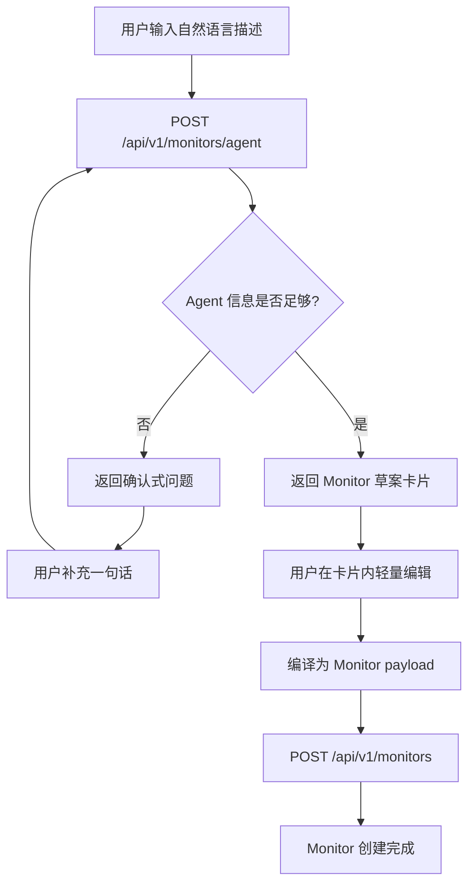
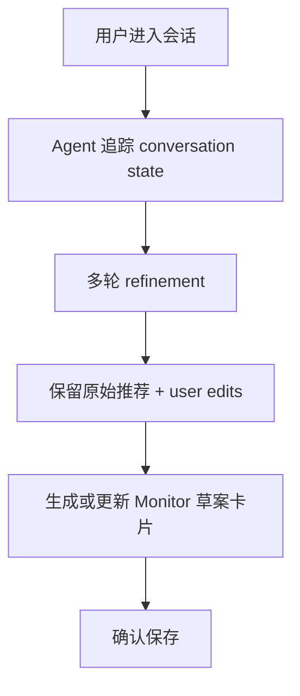
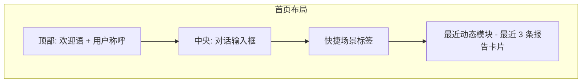
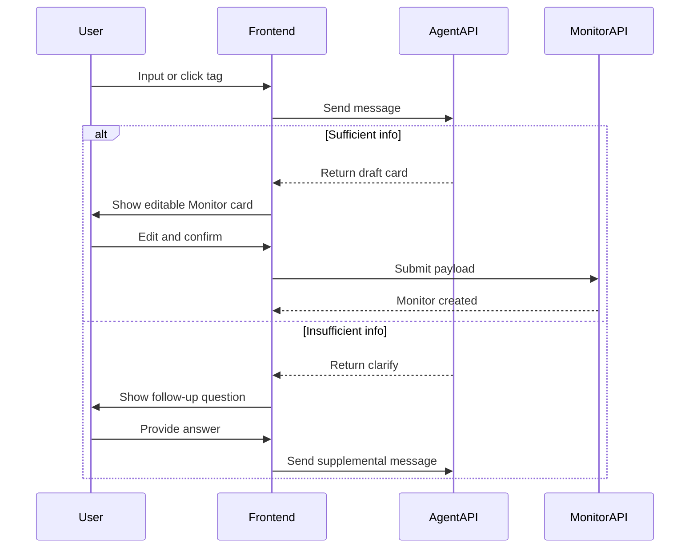

## 1) 背景与目标

Insight Flow 当前创建 Monitor 仍以"手动选源 + 手动配频率"为主，这对熟悉系统的人是高可控的，但对新用户有两个明显门槛：

- 用户知道自己想关注什么主题，但不知道应该选哪些 Source
- 用户不知道 X、Reddit、学术源在系统里分别该如何配置

<aside>
🎯

**目标：** 提供一个 **会话型 Monitor Agent** —— 用户用自然语言描述关注方向，Agent 自动补全配置，仅在必要时追问，输出可编辑的 Monitor 卡片，最终落到现有 `MonitorCreate` contract。

</aside>

该功能首先是一个 **创建体验增强层**，不是新的采集/调度底层。

相关设计文档：

- [Monitor Agent Runtime Design](/Users/leo/workspace/Lexmount/insight-flow/docs/design/monitor-agent-runtime-design.md)
- [Monitor Agent Implementation Design](/Users/leo/workspace/Lexmount/insight-flow/docs/design/monitor-agent-implementation-design.md)

---

## 2) 设计原则

1. **白箱优先，不做黑箱创建** — 用户必须能看到推荐了哪些源、账号、subreddit、论文关键词及运行频率
2. **默认自动补全，追问最小化** — 先给出一版可编辑结果，无法可靠补全时才追问
3. **P0 严格复用现有 Monitor 模型** — 不新增数据库字段，不改变 `POST /api/v1/monitors` 核心语义
4. **推荐草案与创建 payload 分离** — 展示层可用高层概念，创建层必须映射为已支持的 source 绑定方式
5. **P0 只覆盖当前已具备的采集能力** — 预置 Blog/RSS、共享 X/Reddit Source、arXiv/OpenAlex/Europe PMC/PubMed 等

---

## 3) 当前代码约束

### 3.1 Monitor 的真实存储模型

核心配置是"绑定哪些 source，以及对每个 source 做什么 override"：

- `X 账号推荐` → 绑定已有 `x_social` Source，override 中写入 `usernames`
- `Reddit 社区推荐` → 绑定已有 `reddit_social` Source，override 中写入 `subreddits`
- `论文关键词推荐` → 绑定学术 Source，override 中写入 `keywords` / `expanded_keywords` / `max_results`

### 3.2 Source 目录的权威来源

P0 不另建平行"预置源索引库"。推荐基于：

1. `sources` 表中的当前可用 Source
2. 少量附加推荐元数据（领域标签、别名、推荐理由模板等）

### 3.3 调度的真实表达方式

- `time_period`: `daily | weekly | custom`
- `custom_schedule`: cron 或 `interval:N@HH:MM`

"工作日推送""每周一三五"必须编译为上述字段，不落成新的 `frequency` 持久化字段。

### 3.4 Source ID 必须使用 UUID

`Source.id` 是 UUID。草案生成服务返回的可绑定 source 必须使用 UUID。

### 3.5 当前 contract 的参数边界

P0 agent/tool 不能生成超出当前后端归一化逻辑的配置：

- `window_hours` 仅允许 `1..168`
- `source_overrides[*].max_items` 仅允许 `1..200`
- `source_overrides[*].max_results` 仅允许 `1..200`
- `keywords` / `expanded_keywords` 最多保留 20 项
- `arxiv` 的 `expanded_keywords` 会基于 `keywords` 自动扩展，不要求 LLM 自己生成一整套扩展词

---

## 4) 功能定义

用户输入自然语言后，系统进入 **轻量对齐流程**：

1. Agent 识别用户意图
2. 信息足够 → 直接生成 **Monitor 草案**
3. 关键缺失/冲突/低置信度 → 返回确认式追问
4. 用户补充后 → 生成草案

草案分为两层：

### 4.1 展示层草案

用于前端卡片预览：推荐标题、推荐摘要、Blog/Website 源、X 账号、Reddit 社区、学术关键词、调度建议、不支持项或待补充项。

### 4.2 创建层 payload

直接兼容 `POST /api/v1/monitors`：`name`、`time_period`、`report_type`、`source_ids`、`source_overrides`、`window_hours`、`custom_schedule`、`enabled`。

---

## 5) 推荐项到现有模型的映射规则

<aside>
⚠️

这是本文档最关键的部分。

</aside>

| **用户可见推荐项** | **P0 落地方式** | **说明** |
| --- | --- | --- |
| 已有 Blog / 官网 RSS | 直接加入 `source_ids` | 仅限系统已有 Source |
| X 账号列表 | 绑定共享 X Source + `source_overrides[id].usernames` | 不为每个账号单独建 Source |
| Reddit 社区列表 | 绑定共享 Reddit Source + `source_overrides[id].subreddits` | 不为每个 subreddit 单独建 Source |
| 论文关键词 | 绑定学术 Source + `keywords` / `expanded_keywords` / `max_results` | 复用现有学术检索链路 |
| 获取数量建议 | `source_overrides[id].max_items` 或 `max_results` | 沿用现有 override 语义 |
| 采集时间范围 | `window_hours` | 保持现有 Monitor contract |
| 频率建议 | 编译为 `time_period + custom_schedule` | 不新增频率字段 |

### 5.1 Blog / Website 源

P0 只推荐并绑定系统当前已存在、且可用的 Blog / Website Source。

- 能在 Source 目录中找到匹配项 → 标记为 `ready`
- 只能识别合理外部站点但系统内无对应 Source → 标记为 `suggested_unavailable`
- 确认创建时仅提交 `ready` 项

### 5.2 X 推荐

P0 复用共享 X Source。示例：

- 用户想关注 `@OpenAI`, `@AnthropicAI`, `@huggingface`
- `source_ids` 包含 `x_social` 对应 UUID
- `source_overrides[x_social_id].usernames = ["OpenAI", "AnthropicAI", "huggingface"]`

### 5.3 Reddit 推荐

P0 复用共享 Reddit Source。示例：

- 用户想关注 `r/LocalLLaMA`, `r/OpenAI`
- `source_ids` 包含 `reddit_social` 对应 UUID
- `source_overrides[reddit_social_id].subreddits = ["LocalLLaMA", "OpenAI"]`

### 5.4 学术推荐

P0 默认同时启用 `arxiv`（技术前沿）与 `openalex`（泛论文检索），两者互补覆盖更广的学术信息面。

示例：

- `source_ids` 同时包含 `arxiv` UUID 和 `openalex` UUID
- `source_overrides[arxiv_id].keywords = ["AI agent", "agentic workflow"]`
- `source_overrides[arxiv_id].max_results = 40`
- `source_overrides[openalex_id].keywords = ["AI agent", "agentic workflow"]`
- `source_overrides[openalex_id].max_results = 30`

### 5.5 调度推荐

| **推荐语义** | **最终持久化** |
| --- | --- |
| 每天 09:00 | `time_period="daily"`  • `custom_schedule="0 9 * * *"` |
| 每周一 09:00 | `time_period="weekly"`  • `custom_schedule="0 9 * * 1"` |
| 每 2 天 06:30 | `time_period="custom"`  • `custom_schedule="interval:2@06:30"` |

---

## 6) 产品形态与范围

### P0 — 核心可用版本

**包含：**

- 首页 `/` 重构为对话式 Monitor Agent 入口
- 对话框输入意图 → Agent 自动补全 → 仅必要时追问 → 输出可编辑 Monitor 卡片
- 用户可在卡片内轻量编辑 → 编译为 `MonitorCreate` payload → 调用现有 API
- 侧边栏将当前“报告”重命名为“首页”，当前“归档”重命名为“报告”

**不包含：**

- 自动新建外部 Blog Source、热门模板体系、个性化推荐、自动发现新源

### P1 — 对话增强

- 对话状态持久化与恢复
- 更长链路的 refinement
- 原始推荐与用户编辑的差异高亮
- 可选 `POST /api/v1/monitors/agent/confirm` 包装接口

### P2 — 产品化增强

- 模板与领域快捷标签、个性化推荐、未匹配源的半自动创建

---

## 7) 用户流程

### 7.1 P0 流程



### 7.2 P1 流程



---

## 8) 后端设计

### 8.1 新增模块

| **模块** | **职责** | **建议位置** |
| --- | --- | --- |
| `monitor_agent.py` | API 入口后的应用服务，负责会话加载、agent 调用、停止策略与响应封装 | `backend/app/generators/` |
| `monitor_agent_runtime.py` | LangChain `create_agent()` 运行时与 structured output 封装 | `backend/app/generators/` |
| `monitor_agent_tools.py` | tool 定义与 tool schema | `backend/app/generators/` |
| `monitor_conversation_store.py` | `conversation_id` 对应的短期上下文读写，支持 TTL | `backend/app/generators/` |
| `monitor_generator.py` | 协调目录检索、草案拼装与 payload 编译 | `backend/app/generators/` |
| `source_catalog.py` | 从 `sources` 表和附加元数据构建推荐目录 | `backend/app/generators/` |
| `schedule_recommender.py` | 将推荐频率编译为 Monitor 调度字段 | `backend/app/generators/` |

### 8.1.1 框架选型

P0 推荐采用 **LangChain `create_agent()` + 应用层确定性状态机**，而不是直接构建开放式 ReAct agent，也不必一开始就上完整 LangGraph 工作流。

原因：

- 当前任务是**单一目的 agent**：输入一段意图，有限轮澄清，输出一个可创建的 monitor 草案
- tool 集合是**固定且边界清晰**的，不需要开放式规划、子 agent、文件系统操作
- `message + conversation_id` 已经定义为应用层 contract，更适合由业务服务自己维护 TTL 会话状态
- “最多 3 轮澄清”“超过上限必须出 draft” 这类约束需要**业务层硬控制**，不应完全交给 LLM 自主决定

结论：

- **Agent runtime**: LangChain `create_agent()`
- **响应约束**: 使用 `response_format` 输出强类型 `clarify_plan | draft_plan`
- **状态管理**: 应用层 `conversation_store`，按 `conversation_id` 保存短期上下文
- **编译与校验**: Python 确定性函数，不交给 LLM 直接拼最终数据库结构
- **P1/P2** 若后续出现多节点编排、人工中断恢复、复杂并行流程，再下沉到 LangGraph

### 8.1.2 请求执行模式

每次 `POST /api/v1/monitors/agent` 的执行链路建议固定为：

1. API 层根据 `conversation_id` 读取短期上下文
2. 应用服务构造本轮 agent 输入：`message + compact conversation state`
3. LangChain agent 通过有限 tools 产出结构化结果：`clarify_plan` 或 `draft_plan`
4. 业务层根据澄清轮次、缺失字段、tool 结果做最终判定
5. 若输出 draft，则进入确定性 `compile_monitor_payload() -> validate_monitor_payload()`
6. 返回前端 `clarify` 或 `draft`

换句话说，**LLM 负责理解和补全，业务层负责强约束与落库安全**。

### 8.2 推荐目录

主来源：`sources` 表 + 少量静态元数据补充。

静态元数据示例：

```json
{
  "source_id": "8f2d4e6f-7b0e-4c8e-8d1f-2f4d9a111111",
  "aliases": ["OpenAI Blog", "OpenAI News"],
  "domains": ["ai-agent", "foundation-model", "llm"],
  "generator_enabled": true,
  "default_reason": "核心模型与平台能力发布源"
}
```

### 8.3 Agent 响应结构

P0 两种响应模式：**clarify**（需用户确认/补充）与 **draft**（输出草案卡片）。

```tsx
type MonitorAgentResponse =
  | ClarifyResponse
  | DraftResponse;

type ClarifyResponse = {
  mode: "clarify";
  conversation_id?: string;
  message: string;
  missing_or_conflicting_fields?: string[];
};

type DraftResponse = {
  mode: "draft";
  conversation_id?: string;
  message?: string;
  draft: MonitorDraft;
  monitor_payload: MonitorCreateLikePayload;
};
```

### 8.3.1 Draft 顶层结构

```tsx
type MonitorDraft = {
  name: string;
  summary?: string;
  sections: DraftSection[];
  editable: true;
};
```

### 8.3.2 Section 结构

```tsx
type DraftSectionKind =
  | "source_list" | "x_accounts" | "reddit_communities"
  | "academic_keywords" | "collection_scope" | "schedule" | "unsupported";

type DraftSection = {
  kind: DraftSectionKind;
  title: string;
  summary?: string;
  items: DraftItem[];
};
```

约束：每个 section 必须有 `kind`、`title`、`items`；`schedule` 与 `unsupported` 也视为 section。

### 8.3.2a 预览区轻量编辑语义

前端区分原始 draft、用户编辑、生效 draft：

```tsx
type DraftEditingState = {
  draft: MonitorDraft;       // 只读
  user_edits: DraftUserEdits;
  effective_draft: MonitorDraft; // 界面展示
};

type DraftUserEdits = {
  removed_item_keys?: string[];
  added_ready_source_ids?: string[];
  added_keywords?: string[];
  removed_keywords?: string[];
  added_x_accounts?: string[];
  removed_x_accounts?: string[];
  added_reddit_communities?: string[];
  removed_reddit_communities?: string[];
  selected_window_hours?: number;
  source_limit_overrides?: Record<string, number>;
  source_max_results_overrides?: Record<string, number>;
  selected_schedule_key?: string;
};
```

最终 `monitor_payload` 基于 `effective_draft` 编译。

约束补充：

- `added_ready_source_ids` 仅允许来自当前 source catalog 的现有 Source，不支持输入任意外部 URL
- `selected_window_hours` 必须限制在 `1..168`
- `source_limit_overrides` / `source_max_results_overrides` 必须限制在 `1..200`
- 这类数值编辑必须在卡片中可见，不允许 agent 偷偷写入 payload

### 8.3.3 Item 基础结构

```tsx
type DraftItemStatus = "ready" | "suggested" | "unavailable" | "unsupported";

type DraftItemBase = {
  key: string;
  type: string;
  label: string;
  status: DraftItemStatus;
  reason?: string;
};
```

### 8.3.4 各类 Item 扩展结构

```tsx
type DraftSourceItem = DraftItemBase & {
  type: "source"; source_id?: string; source_key?: string; url?: string;
};
type DraftAccountItem = DraftItemBase & {
  type: "x_account"; handle: string;
};
type DraftCommunityItem = DraftItemBase & {
  type: "reddit_community"; subreddit: string;
};
type DraftKeywordItem = DraftItemBase & {
  type: "keyword"; keyword: string;
};
type DraftWindowItem = DraftItemBase & {
  type: "window"; window_hours: number;
};
type DraftSourceLimitItem = DraftItemBase & {
  type: "source_limit"; source_id: string; field: "max_items" | "max_results"; value: number;
};
type DraftScheduleItem = DraftItemBase & {
  type: "schedule"; time_period: "daily" | "weekly" | "custom"; custom_schedule?: string;
};
type DraftUnsupportedItem = DraftItemBase & {
  type: "unsupported"; raw_value?: string; suggestion?: string;
};

type DraftItem =
  | DraftSourceItem | DraftAccountItem | DraftCommunityItem
  | DraftKeywordItem | DraftWindowItem | DraftSourceLimitItem
  | DraftScheduleItem | DraftUnsupportedItem;
```

### 8.3.5 创建层映射规则

- `source` + `status == "ready"` → `source_id` 加入 `source_ids`
- `x_account` + `status ∈ {ready, suggested}` → 汇总为共享 X Source 的 `usernames`
- `reddit_community` + `status ∈ {ready, suggested}` → 汇总为共享 Reddit Source 的 `subreddits`
- `keyword` + `status ∈ {ready, suggested}` → 汇总为学术 Source 的 `keywords`
- `window` → 编译为 `window_hours`
- `source_limit` → 编译为对应 `source_overrides[source_id][field]`
- `schedule` → 编译为 `time_period + custom_schedule`
- `unavailable` / `unsupported` → 不进入创建层

### 8.3.6 完整示例

```json
{
  "draft": {
    "name": "Agent 前沿动态",
    "summary": "跟踪 Agent 框架、模型能力、社区讨论与相关论文。",
    "sections": [
      {
        "kind": "source_list",
        "title": "Blog / Website",
        "items": [
          { "key": "source:openai-blog", "type": "source", "source_id": "11111111-1111-1111-1111-111111111111", "label": "OpenAI Blog", "status": "ready", "reason": "Agent SDK 与模型能力发布源" }
        ]
      },
      {
        "kind": "x_accounts",
        "title": "X 账号",
        "items": [
          { "key": "x:OpenAI", "type": "x_account", "label": "@OpenAI", "status": "suggested", "handle": "OpenAI" },
          { "key": "x:AnthropicAI", "type": "x_account", "label": "@AnthropicAI", "status": "suggested", "handle": "AnthropicAI" }
        ]
      },
      {
        "kind": "reddit_communities",
        "title": "Reddit 社区",
        "items": [
          { "key": "reddit:LocalLLaMA", "type": "reddit_community", "label": "r/LocalLLaMA", "status": "suggested", "subreddit": "LocalLLaMA" }
        ]
      },
      {
        "kind": "academic_keywords",
        "title": "论文关键词",
        "items": [
          { "key": "keyword:ai-agent", "type": "keyword", "label": "AI agent", "status": "suggested", "keyword": "AI agent" },
          { "key": "keyword:agentic-workflow", "type": "keyword", "label": "agentic workflow", "status": "suggested", "keyword": "agentic workflow" }
        ]
      },
      {
        "kind": "collection_scope",
        "title": "采集范围",
        "items": [
          { "key": "window:24h", "type": "window", "label": "近 24 小时", "status": "ready", "window_hours": 24 },
          { "key": "limit:arxiv:max_results", "type": "source_limit", "label": "arXiv 每次抓取 40 条", "status": "ready", "source_id": "44444444-4444-4444-4444-444444444444", "field": "max_results", "value": 40 },
          { "key": "limit:openalex:max_results", "type": "source_limit", "label": "OpenAlex 每次抓取 30 条", "status": "ready", "source_id": "55555555-5555-5555-5555-555555555555", "field": "max_results", "value": 30 }
        ]
      },
      {
        "kind": "schedule",
        "title": "调度建议",
        "items": [
          { "key": "schedule:daily-0900", "type": "schedule", "label": "每天 09:00", "status": "ready", "time_period": "daily", "custom_schedule": "0 9 * * *" }
        ]
      },
      {
        "kind": "unsupported",
        "title": "暂不支持",
        "items": [
          { "key": "unsupported:wechat", "type": "unsupported", "label": "微信公众号", "status": "unsupported", "suggestion": "建议使用其公开 Blog 或 RSS 桥接结果" }
        ]
      }
    ]
  },
  "monitor_payload": {
    "name": "Agent 前沿动态",
    "time_period": "daily",
    "report_type": "daily",
    "source_ids": [
      "11111111-1111-1111-1111-111111111111",
      "22222222-2222-2222-2222-222222222222",
      "33333333-3333-3333-3333-333333333333",
      "44444444-4444-4444-4444-444444444444",
      "55555555-5555-5555-5555-555555555555"
    ],
    "source_overrides": {
      "22222222-2222-2222-2222-222222222222": { "usernames": ["OpenAI", "AnthropicAI"] },
      "33333333-3333-3333-3333-333333333333": { "subreddits": ["LocalLLaMA"] },
      "44444444-4444-4444-4444-444444444444": { "keywords": ["AI agent", "agentic workflow"], "max_results": 40 },
      "55555555-5555-5555-5555-555555555555": { "keywords": ["AI agent", "agentic workflow"], "max_results": 30 }
    },
    "window_hours": 24,
    "custom_schedule": "0 9 * * *",
    "enabled": true
  }
}
```

### 8.4 API 设计

**Agent 交互：**

```
POST /api/v1/monitors/agent
```

```json
{
  "message": "我想跟踪 Agent 领域的最前沿内容",
  "conversation_id": "optional"
}
```

- 信息不足 → 返回 `mode: "clarify"`
- 可生成卡片 → 返回 `mode: "draft"`

**保存创建：** P0 直接提交 `monitor_payload` 到 `POST /api/v1/monitors`，P1 可增加 `POST /api/v1/monitors/agent/confirm` 包装层。

### 8.5 Agent Tool 设计

P0 不建议把 Monitor Agent 设计成“能随便调用任何工具”的通用 agent，而应使用**少量、强约束、返回结构稳定的业务 tools**。

#### 8.5.1 Tool 分层

| **Tool 名称** | **类型** | **作用** | **是否副作用** |
| --- | --- | --- | --- |
| `search_source_catalog` | 目录检索 | 从现有 `sources` + metadata 中挑选可直接绑定的 Blog/Website Source | 否 |
| `get_shared_source_registry` | 目录检索 | 返回共享 X / Reddit / arXiv / OpenAlex Source 的 UUID 与可用性 | 否 |
| `recommend_x_accounts` | 推荐 | 根据主题生成推荐 X handles | 否 |
| `recommend_reddit_communities` | 推荐 | 根据主题生成推荐 subreddit | 否 |
| `recommend_academic_plan` | 推荐 | 生成学术关键词、适用 source、建议 `max_results` | 否 |
| `recommend_collection_scope` | 推荐 | 生成 `window_hours` 与必要的 `max_items/max_results` 建议 | 否 |
| `recommend_schedule` | 推荐 | 生成 `time_period + custom_schedule` 建议 | 否 |
| `compile_monitor_payload` | 编译 | 把 draft 编译为现有 `MonitorCreate` payload | 否 |
| `validate_monitor_payload` | 校验 | 用当前约束校验 payload 是否可创建 | 否 |
| `create_monitor` | 落库 | 在用户确认保存后真正调用 `POST /api/v1/monitors` | 是 |

#### 8.5.2 Tool 使用原则

- `search_source_catalog`、`get_shared_source_registry` 是**事实来源工具**
- `recommend_*` 是**受约束的补全工具**，输出只能是业务可落地的候选项
- `compile_monitor_payload`、`validate_monitor_payload` 必须是**确定性 Python 函数**，不能由 LLM 直接手搓 JSON
- `create_monitor` 不参与草案生成链路，只在用户点击保存时调用

#### 8.5.3 建议的 Tool 输入输出

`search_source_catalog`

```tsx
type SearchSourceCatalogInput = {
  topic: string;
  categories?: Array<"blog" | "open_source" | "academic" | "social">;
  limit?: number;
};

type SearchSourceCatalogOutput = {
  candidates: Array<{
    source_id: string;
    name: string;
    category: string;
    enabled: boolean;
    status: "ready" | "unavailable";
    reason?: string;
  }>;
};
```

`get_shared_source_registry`

```tsx
type SharedSourceRegistryOutput = {
  x_social?: { source_id: string; enabled: boolean };
  reddit_social?: { source_id: string; enabled: boolean };
  arxiv?: { source_id: string; enabled: boolean };
  openalex?: { source_id: string; enabled: boolean };
};
```

`recommend_academic_plan`

```tsx
type RecommendAcademicPlanInput = {
  topic: string;
  intent_summary?: string;
  user_constraints?: string[];
};

type RecommendAcademicPlanOutput = {
  keywords: string[];
  preferred_sources: Array<"arxiv" | "openalex">;
  source_max_results?: Record<string, number>;
};
```

`recommend_collection_scope`

```tsx
type RecommendCollectionScopeOutput = {
  window_hours: number;
  source_limits?: Record<string, { field: "max_items" | "max_results"; value: number }>;
  rationale?: string;
};
```

`recommend_schedule`

```tsx
type RecommendScheduleOutput = {
  label: string;
  time_period: "daily" | "weekly" | "custom";
  custom_schedule?: string;
  rationale?: string;
};
```

`compile_monitor_payload`

```tsx
type CompileMonitorPayloadInput = {
  effective_draft: MonitorDraft;
};

type CompileMonitorPayloadOutput = {
  payload: MonitorCreateLikePayload;
  inferred_fields?: string[];
};
```

`validate_monitor_payload`

```tsx
type ValidateMonitorPayloadOutput = {
  valid: boolean;
  errors: string[];
  normalized_payload?: MonitorCreateLikePayload;
};
```

#### 8.5.4 Agent 与 Tool 的职责切分

Agent 负责：

- 识别主题、偏好、噪音容忍度、关注对象类型
- 决定是否需要追问
- 选择调用哪些 tool，以及如何组合 tool 结果
- 输出用户可读的确认文案与草案摘要

Tool / 业务层负责：

- 检索真实可用 Source
- 返回共享 Source 的 UUID
- 约束数量范围、关键词数量、窗口范围
- 编译和校验最终 payload

这能避免 agent 出现“理解是对的，但生成了一个系统根本不能创建的 monitor”。

### 8.6 会话状态设计

P0 的 `conversation_id` 建议只承载**短期创建会话**，不承载长期用户画像。

```tsx
type MonitorConversationState = {
  conversation_id: string;
  clarify_turn_count: number;
  intent_summary?: string;
  extracted_preferences?: {
    topic?: string;
    emphasis?: Array<"news" | "community" | "academic">;
    cadence_preference?: "high" | "medium" | "low";
  };
  last_missing_fields?: string[];
  last_draft?: MonitorDraft;
  inferred_fields?: string[];
  expires_at: string;
};
```

建议：

- **默认实现**：进程内 TTL store，便于 P0 快速落地
- **部署优先实现**：Redis TTL store，与当前系统基础设施一致
- 不新增数据库表，不做长期 durable memory

### 8.7 Agent 职责边界

- **Conversation Agent** — 理解主题、对象类型、更新节奏偏好；自动补全；仅必要时追问；输出确认式文案
- **目录与规则层** — 从 Source 目录检索候选；识别共享 Source；决定哪些可进入创建层
- **payload 编译层** — UUID 映射、`source_ids`/`source_overrides` 结构化、`time_period`/`custom_schedule` 编译

LLM 在 P0 主要承担"意图识别""默认补全""确认式文案生成"，**不负责**直接决定数据库写入结构、自动创建新 Source、访问外部站点做发现。

### 8.8 何时追问

P0 中 Monitor Agent 以“默认直接给草案”为优先策略，仅在信息不足时追问。

只有以下情况才追问：

- 用户意图过于模糊，无法判断主题
- 用户要求存在明显冲突
- 用户指定了当前系统不支持的核心能力
- 推荐结果置信度过低

### 8.8.1 澄清轮次上限

- 用户首条输入后，若信息已足够，直接返回 `mode: "draft"`
- 若信息不足，可返回 `mode: "clarify"`
- P0 澄清轮次最多 3 轮

### 8.8.2 停止追问条件

满足以下任一条件后，Agent 必须停止追问并直接产出草案：

- Agent 判断主题与主要偏好已足够明确
- 已达到 3 轮澄清上限
- 用户明确表达“先这样”“直接生成”“先给我一版”

### 8.8.3 达到上限后的处理策略

如果达到 3 轮后仍存在不确定性，Agent 不应报错或要求继续补充，而应：

- 基于默认策略自动补全剩余配置
- 直接返回 `mode: "draft"`
- 在草案说明中标明哪些部分属于系统默认推断

推荐的默认补全方式：

- 默认优先保留用户已明确表达的主题与偏好
- 未明确的源类型按主题自动补全
- 未明确的频率按保守但可用的默认值生成
- 不支持项继续放入 `unsupported` section，而不是阻塞草案生成

### 8.8.4 自主补全策略边界

P0 中不为 Agent 预设一套固定的“默认模板组合”。Agent 可以根据用户意图和上下文，自主决定：

- 选择哪些 source 类型参与推荐
- 选择哪些具体 Source 进入草案
- 为学术 Source 生成哪些关键词
- 采用更高频还是更低频的调度建议
- 为不同 Source 设置怎样的获取范围与数量建议

但这种自主补全必须满足以下约束：

- 必须优先使用当前系统可落地的 Source 与调度表达
- 不能生成无法编译为现有 `MonitorCreate` 的配置
- 如果存在多种合理方案，Agent 应先给出它判断最合适的一版，而不是把选择题全部抛给用户
- 所有自主补全项都必须在卡片中可见、可编辑、可删除
- 无法可靠落地的项必须进入 `unsupported` 或 `unavailable`，而不是偷偷进入创建层 payload
- 对 `window_hours`、`max_items`、`max_results` 的建议必须落在当前 contract 边界内
- “新增 Source” 在 P0 仅表示从现有目录补选 `ready` Source，不表示新建任意外部站点

产品语义上，Agent 是“自主补全但受约束”，不是“无限自由生成”。

追问风格为"确认式"：

- *我先按"Agent 前沿追踪"理解，你更想看框架和产品动态，还是论文和研究？*
- *我默认给你配日报，如果你更想降噪，我可以切成周报。*

---

## 9) 前端设计

### 9.1 导航重构

<aside>
🔄

**核心变更：** 将原首页 `/`（展示最近 10 条报告）替换为对话式 AI 入口，侧边栏原"报告"改名为"首页"，原"归档"改名为"报告"，统一承接所有报告浏览。

</aside>

**现有导航 → 改造后导航：**

| **现有** | **改造后** | **说明** |
| --- | --- | --- |
| 📡 报告（`/`，最近 10 条） | 🏠 **首页**（`/`，对话式 AI 入口） | 核心变更：从被动展示变为主动交互 |
| 📋 任务 | 📋 任务 | 保持不变，即 Monitor 列表 |
| 📊 归档（`/library`） | 📰 **报告**（仍使用 `/library`） | P0 先复用现有归档页与数据结构，仅调整命名 |
| 🔗 信息源 | 🔗 信息源 | 保持不变 |
| ⚙️ 模型配置 | ⚙️ 模型配置 | 保持不变 |
| 📤 输出配置 | 📤 输出配置 | 保持不变 |

**改造优势：**

- 首页职责更聚焦 — 从"被动展示最近报告"变为"主动引导用户创建/交互"，提升新用户上手体验
- 报告入口统一 — 不再有"首页看最近的"和"归档看历史的"两个割裂入口
- 对话式创建自然落地 — 首页即 Monitor Agent 交互入口，与现有导航无缝整合

P0 约束：

- 首页主入口固定为 `/`
- 历史报告页面继续复用 `/library`
- Monitor 页不作为 P0 主入口，可保留未来作为次级入口的可能，但不进入本期范围

### 9.2 首页布局设计（对话式 AI 入口）

参考 ChatGPT 与 Yutori 的交互形态，采用**对话框居中 + 快捷标签 + 最近动态**的三层结构。

#### 9.2.1 页面结构



#### 9.2.2 各区域详细设计

**① 欢迎语区域**

- 个性化欢迎："想关注什么领域？" 或 "What shall we monitor, {username}?"
- 简洁品牌感，参考 Yutori 的 "What shall we scout, Leo?"

**② 对话输入框**

- 居中大输入框，placeholder 如："描述你想关注的内容…"
- 支持多行输入
- 输入后发送至 `POST /api/v1/monitors/agent`
- Agent 回复（草案卡片 / 追问）在输入框下方以对话气泡形式展示

**③ 快捷场景标签**

- 输入框下方排列一行可点击标签，点击即预填对话
- P0 预设标签示例：`AI 前沿` `行业动态` `学术论文` `社交热点` `竞品监控`
- 每个标签对应一条预设 prompt，点击后自动发送给 Agent

**④ 最近动态模块**

- 展示最近 **3 条**报告的简要卡片（标题、所属 Monitor、生成时间、摘要前 2 行）
- 右上角 "查看全部 →" 链接跳转至 `/library`（侧边栏文案显示为"报告"）
- 保留用户打开首页即可感知最新信息动态的能力，但不喧宾夺主

#### 9.2.3 对话交互流程



### 9.3 草案卡片 UI

**展示内容：** 推荐名称、推荐摘要、可绑定的 Blog/Source、X 账号、Reddit 社区、学术关键词、推荐频率、无法创建的项

**轻量编辑：** 移除推荐项；补选现有目录中的 `ready` Source；增删关键词、X 账号、subreddit；调整 `window_hours`；调整少量 `max_items/max_results`；在推荐频率选项中切换

P0 不在卡片内暴露完整 Monitor 高级表单。

### 9.4 P1/P2 前端增强

- 对话状态持久化：刷新后恢复上次未完成的创建会话
- 快捷标签支持用户自定义和领域推荐
- 首页最近动态支持更丰富的报告预览（展开摘要、关键发现高亮等）
- 已有 Monitor 状态概览卡片（运行中/暂停/异常）
- 登录后"我的 Monitor"首页捷径

不阻塞 P0。

---

## 10) 完整示例

### 用户输入

> 我想跟踪 Agent 领域的最前沿内容
>

### 展示层草案

- **Blog / Website** — OpenAI Blog, LangChain Blog, Anthropic
- **X 账号** — `@OpenAI`, `@AnthropicAI`, `@LangChainAI`
- **Reddit** — `r/LocalLLaMA`, `r/OpenAI`
- **论文关键词** — `AI agent`, `agentic workflow`, `tool-use LLM`
- **调度建议** — 每天 09:00

### 创建层 payload

```json
{
  "name": "Agent 前沿动态",
  "time_period": "daily",
  "report_type": "daily",
  "source_ids": [
    "11111111-1111-1111-1111-111111111111",
    "22222222-2222-2222-2222-222222222222",
    "33333333-3333-3333-3333-333333333333",
    "44444444-4444-4444-4444-444444444444",
    "55555555-5555-5555-5555-555555555555"
  ],
  "source_overrides": {
    "22222222-2222-2222-2222-222222222222": { "usernames": ["OpenAI", "AnthropicAI", "LangChainAI"] },
    "33333333-3333-3333-3333-333333333333": { "subreddits": ["LocalLLaMA", "OpenAI"] },
    "44444444-4444-4444-4444-444444444444": { "keywords": ["AI agent", "agentic workflow", "tool-use LLM"], "max_results": 40 },
    "55555555-5555-5555-5555-555555555555": { "keywords": ["AI agent", "agentic workflow", "tool-use LLM"], "max_results": 30 }
  },
  "window_hours": 24,
  "custom_schedule": "0 9 * * *",
  "enabled": true
}
```

---

## 11) 分阶段路线图

### Phase 1 — P0 可用版本

- [ ]  新增 `POST /api/v1/monitors/agent`
- [ ]  引入会话型 Monitor Agent（P0 基于 LangChain）
- [ ]  基于现有 `sources` 表构建推荐目录
- [ ]  支持自动补全 + 必要时最小化追问
- [ ]  输出可编辑的 Monitor 草案卡片
- [ ]  生成 `MonitorCreate` 兼容 payload
- [ ]  前端将首页 `/` 重构为对话式 Agent 入口
- [ ]  侧边栏将“报告”改名为“首页”，将“归档”改名为“报告”
- [ ]  用户可在卡片内轻量编辑并直接创建

### Phase 2 — P1 对话增强

- [ ]  对话状态持久化与恢复
- [ ]  refinement 增量更新
- [ ]  原始推荐与用户编辑差异展示
- [ ]  可选确认包装接口

### Phase 3 — P2 产品化增强

- [ ]  首页增强布局与品牌化 Hero
- [ ]  模板体系与快捷标签
- [ ]  个性化推荐
- [ ]  未匹配源的半自动创建流程

---

## 12) 非目标

P0 **不包含**：新增 Monitor 表字段、新建 draft/conversation 数据库表、自动发现并创建任意外部 RSS 源、引入新的 X/Reddit/学术采集器、修改调度器模型。

---

## 13) 风险与缓解

| **风险** | **缓解措施** |
| --- | --- |
| 推荐草案好看但 payload 不可创建 | 生成时同步产出 `monitor_payload`，仅可映射项进入创建层 |
| 推荐目录与真实 Source 漂移 | 以 `sources` 表为主目录，补充元数据仅做标签增强 |
| 多轮对话过早引入导致状态复杂 | P0 只做最小化确认式对话，复杂对话延后 P1 |
| 调度推荐与实际行为不一致 | 推荐语义必须编译为现有 `time_period + custom_schedule` |
| Agent 乱用 tool 导致结构失控 | tool 数量保持小而稳，编译与校验必须是确定性函数 |
| LLM 自主补全越过当前 contract 边界 | 业务层对 `window_hours/max_items/max_results` 做二次校验和裁剪 |

---

## 14) 已确认 & 仍需确认的问题

### ✅ 已确认

- [x]  **P0 学术默认启用 `arxiv + openalex`** — 两者互补：arxiv 覆盖技术前沿预印本，openalex 覆盖更广泛的同行评审论文。文档中 5.4、8.3.6、10 节已同步更新。
- [x]  **P0 Agent LLM 使用模型配置中的 `llm_openai`** — Monitor Agent 背后的意图识别、推荐补全、确认式文案生成，统一复用用户在"模型配置"页已配置的 `llm_openai` provider。不单独新增配置项，与报告生成 LLM 共用同一 provider 选择。
- [x]  **P0 会话 contract 使用 `message + conversation_id`，由后端短期持有上下文** — 前端每轮只发送新消息和会话标识，后端使用 Redis 或进程内缓存按 `conversation_id` 维护短期上下文；LangChain 只消费业务层整理后的 compact state，不要求前端传完整 messages。

### ❓ 仍需确认

- [ ]  **推荐目录附加元数据的存储方式**

    8.2 节提到 Source 推荐需要"少量附加元数据"（如 `aliases`、`domains`、`default_reason`），这些数据不在 `sources` 表里，需要额外存放。

    **建议方案：** P0 使用 **YAML 配置文件**（`config/source_metadata.yaml`），兼顾可读性与可编辑性，不引入数据库变更。后续 P2 可迁移至数据库。

    **具体示例 — `config/source_metadata.yaml`：**

    ```yaml
    # 推荐目录附加元数据
    # 每个条目的 source_id 对应 sources 表中的 UUID
    # Agent 根据用户输入的主题，匹配 domains/aliases 来推荐合适的 Source

    sources:
      - source_id: "8f2d4e6f-7b0e-4c8e-8d1f-2f4d9a111111"
        source_key: "openai_blog"
        aliases: ["OpenAI Blog", "OpenAI News", "OpenAI 博客"]
        domains: ["ai-agent", "foundation-model", "llm", "gpt"]
        generator_enabled: true
        default_reason: "核心模型与平台能力发布源"

      - source_id: "a1b2c3d4-e5f6-7890-abcd-ef1234567890"
        source_key: "langchain_blog"
        aliases: ["LangChain Blog", "LangChain"]
        domains: ["ai-agent", "agent-framework", "rag", "langchain"]
        generator_enabled: true
        default_reason: "主流 Agent 框架与 RAG 生态动态"

      - source_id: "b2c3d4e5-f6a7-8901-bcde-f12345678901"
        source_key: "anthropic_blog"
        aliases: ["Anthropic Blog", "Anthropic", "Claude"]
        domains: ["foundation-model", "ai-safety", "claude", "llm"]
        generator_enabled: true
        default_reason: "Claude 模型能力与 AI 安全研究"

    # 共享 Source（X / Reddit / 学术）不需要 aliases/domains，
    # 因为 Agent 基于用户主题动态生成 usernames/subreddits/keywords
    shared_sources:
      x_social:
        source_id: "22222222-2222-2222-2222-222222222222"
      reddit_social:
        source_id: "33333333-3333-3333-3333-333333333333"
      arxiv:
        source_id: "44444444-4444-4444-4444-444444444444"
      openalex:
        source_id: "55555555-5555-5555-5555-555555555555"
    ```

    **工作流程：** `source_catalog.py` 启动时加载该 YAML → 与 `sources` 表做 JOIN（确认 source_id 仍然有效）→ 构建推荐目录供 Agent 检索。用户说"关注 Agent 前沿"，Agent 匹配 `domains` 含 `ai-agent` 的条目，推荐对应 Source。

[正式场景示例：跟踪 AI Agent 前沿内容](https://www.notion.so/AI-Agent-ea5129f794a84910be6f38df6763673e?pvs=21)
