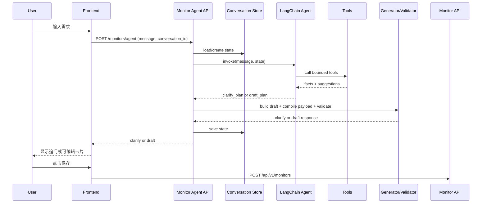

# Monitor Agent Runtime Design

**Date:** 2026-03-23
**Status:** Draft
**Scope:** P0 会话型 Monitor Agent 的 runtime、tool、状态机与失败处理设计

---

## 1. Goal

把“用户输入自然语言 -> 系统生成可编辑 monitor 草案”的链路收敛成一个可控、可测试、可观测的 agent runtime。

P0 的重点不是“做一个自由行动的通用 agent”，而是：

- 正确理解用户意图
- 尽量少追问
- 始终产出可编译、可校验、可创建的 monitor draft

---

## 2. Runtime Definition

P0 Monitor Agent 是一个**受约束的单任务 agent**：

- 输入：`message + conversation_id`
- 中间过程：有限个业务 tool
- 输出：`clarify` 或 `draft`

它不是：

- 通用研究 agent
- 可访问任意网站的浏览 agent
- 可直接修改系统配置的运维 agent

---

## 3. Framework Decision

P0 采用 **LangChain `create_agent()` + 应用层状态机**。

原因：

- 当前任务是单一任务闭环，不需要多子图编排
- tool 集合有限，且业务边界明确
- “最多 3 轮澄清”“超过上限必须给 draft” 必须由业务层硬控
- 最终 payload 需要确定性编译和校验，不应让 LLM 直接控制落库结构

P0 不建议直接使用：

- 开放式 ReAct agent
- LangGraph 多节点图
- side-effectful tool 直接执行创建

LangGraph 可保留到 P1/P2，当出现以下需求再引入：

- 更复杂的多阶段 refinement
- 可恢复的人机中断
- 并行子任务
- 更强的 durable state

### 3.1 Recommended LangChain Shape

P0 推荐的 runtime 形态应接近下面这个结构：

```python
agent = create_agent(
    model=monitor_agent_model,
    tools=[
        search_source_catalog,
        get_shared_source_registry,
        recommend_x_accounts,
        recommend_reddit_communities,
        recommend_academic_plan,
        recommend_collection_scope,
        recommend_schedule,
        compile_monitor_payload,
        validate_monitor_payload,
    ],
    system_prompt=MONITOR_AGENT_SYSTEM_PROMPT,
    response_format=AgentPlan,
    middleware=[tool_error_middleware, tool_logging_middleware],
)
```

约束：

- 必须使用 `create_agent()`
- 必须使用 `response_format`
- 不依赖 agent 自己维护长上下文，短期状态由业务层注入
- middleware 只做日志、错误归一化，不改变核心业务决策

---

## 4. Core Runtime Loop

```text
POST /api/v1/monitors/agent
  -> load conversation state by conversation_id
  -> build compact runtime input
  -> invoke LangChain agent
  -> agent calls bounded tools
  -> agent returns structured plan
  -> application state machine enforces stop policy
  -> compile_monitor_payload()
  -> validate_monitor_payload()
  -> return clarify or draft
```

关键原则：

- LLM 只负责理解、补全、排序、确认式表达
- Python 业务层负责状态、约束、编译、校验
- draft 生成链路内不执行 side effect

### 4.1 User Request Execution Flow

从用户视角看，一次请求的运行机制是：

1. 用户在首页输入需求，例如“我想跟踪 agent 最前沿的内容”
2. 前端发送 `message + conversation_id` 到 `POST /api/v1/monitors/agent`
3. 后端读取当前短期会话状态
4. agent 判断本轮是应该：
   - 直接生成 draft
   - 还是先做一次必要澄清
5. 如果需要补全信息，agent 调用有限 tools：
   - 查现有 source catalog
   - 查共享 source registry
   - 生成 X / Reddit / academic / schedule / scope 建议
6. 应用层把这些结果组装成可编辑 draft
7. 确定性代码把 draft 编译成 `MonitorCreate`
8. 确定性代码校验 payload 是否符合当前后端 contract
9. 后端返回两种结果之一：
   - `clarify`
   - `draft`
10. 用户编辑卡片并点击保存后，前端才调用现有 `POST /api/v1/monitors`

这个机制的关键点是：

- agent 负责理解和补全
- tool 负责提供事实和建议
- 确定性代码负责最终结构安全
- 真正创建 monitor 不在 agent draft 链路内发生

### 4.2 Sequence Diagram



---

## 5. Runtime State Machine

### 5.1 States

- `collecting_intent`
- `clarifying`
- `draft_ready`
- `failed_fallback`

### 5.2 Transitions

```text
collecting_intent
  -> draft_ready        if enough info
  -> clarifying         if critical ambiguity exists

clarifying
  -> draft_ready        if enough info
  -> failed_fallback    if tool/runtime fails
  -> draft_ready        if clarify_turn_count >= 3

failed_fallback
  -> draft_ready        if minimum compilable draft can be inferred
```

### 5.3 Business Stop Policy

以下任一条件满足，必须停止追问并产出 draft：

- 主题已经足够明确
- 用户明确表示“先这样”“直接生成”
- 澄清轮次达到 3

---

## 6. Structured Output Contract

LangChain agent 应使用 `response_format` 返回强类型结果，而不是返回自由文本后再做字符串解析。

```tsx
type AgentPlan =
  | {
      mode: "clarify_plan";
      user_message: string;
      missing_fields: string[];
      confidence: "low" | "medium";
    }
  | {
      mode: "draft_plan";
      intent_summary: string;
      inferred_fields: string[];
      confidence: "medium" | "high";
      draft_outline: {
        topic: string;
        source_types: Array<"blog" | "social" | "academic">;
        cadence_preference?: "high" | "medium" | "low";
      };
    };
```

注意：

- `clarify_plan` 不是最终 API 返回
- `draft_plan` 也不是最终 monitor payload
- 最终 API 响应由应用层二次封装

### 6.1 Recommended Python Models

建议最终代码直接使用 Pydantic 模型，而不是 dict 类型别名。

```python
class DraftOutline(BaseModel):
    topic: str
    source_types: list[Literal["blog", "social", "academic"]]
    cadence_preference: Literal["high", "medium", "low"] | None = None


class ClarifyPlan(BaseModel):
    mode: Literal["clarify_plan"]
    user_message: str
    missing_fields: list[str] = Field(default_factory=list)
    confidence: Literal["low", "medium"]


class DraftPlan(BaseModel):
    mode: Literal["draft_plan"]
    intent_summary: str
    inferred_fields: list[str] = Field(default_factory=list)
    confidence: Literal["medium", "high"]
    draft_outline: DraftOutline


AgentPlan = ClarifyPlan | DraftPlan
```

这样可以直接和 `response_format=AgentPlan` 对齐，减少中间解析层。

---

## 7. Conversation State

P0 的 `conversation_id` 只承载**短期创建上下文**。

```tsx
type MonitorConversationState = {
  conversation_id: string;
  clarify_turn_count: number;
  intent_summary?: string;
  extracted_preferences?: {
    topic?: string;
    emphasis?: Array<"news" | "community" | "academic">;
    cadence_preference?: "high" | "medium" | "low";
  };
  last_missing_fields?: string[];
  last_draft_snapshot?: {
    name?: string;
    source_ids?: string[];
    keywords?: string[];
    window_hours?: number;
    custom_schedule?: string;
  };
  inferred_fields?: string[];
  expires_at: string;
};
```

约束：

- 不保存完整长消息历史
- 不做长期用户偏好建模
- 不跨 monitor 创建会话复用

建议 TTL：

- 30 分钟到 2 小时均可
- 超时后允许前端以新会话重新开始

---

## 8. Tool Registry Design

P0 runtime 只注册**读和编译类 tool**。

### 8.0 Tool Count

按当前 P0 设计，Monitor Agent runtime 一共注册 **9 个 tools**。

其中：

- 2 个事实层 tool
- 5 个建议层 tool
- 2 个确定性编译/校验 tool

具体是：

1. `search_source_catalog`
2. `get_shared_source_registry`
3. `recommend_x_accounts`
4. `recommend_reddit_communities`
5. `recommend_academic_plan`
6. `recommend_collection_scope`
7. `recommend_schedule`
8. `compile_monitor_payload`
9. `validate_monitor_payload`

明确不算进 runtime tool 数量的能力：

- `create_monitor`
- `create_source`
- 任意外部搜索
- 任意浏览器操作

### 8.0.1 Tool Overview Table

| Tool | Layer | Primary Input | Primary Output | Usually Required | Implemented By |
| --- | --- | --- | --- | --- | --- |
| `search_source_catalog` | facts | `topic`, `source_types`, `limit` | existing source candidates | conditional | `source_catalog.py` |
| `get_shared_source_registry` | facts | none | shared source refs with UUID | yes | `source_catalog.py` |
| `recommend_x_accounts` | suggestions | `topic`, `intent_summary`, `limit` | suggested X handles | conditional | `monitor_agent_tools.py` |
| `recommend_reddit_communities` | suggestions | `topic`, `intent_summary`, `limit` | suggested subreddit list | conditional | `monitor_agent_tools.py` |
| `recommend_academic_plan` | suggestions | `topic`, `intent_summary` | keywords + academic source plan | conditional | `monitor_agent_tools.py` |
| `recommend_collection_scope` | suggestions | `topic`, `cadence_preference`, `source_types` | `window_hours` + source limits | yes | `monitor_agent_tools.py` / `schedule_recommender.py` |
| `recommend_schedule` | suggestions | `topic`, `cadence_preference` | one schedule suggestion | yes | `schedule_recommender.py` |
| `compile_monitor_payload` | deterministic | `draft` | `MonitorCreate` payload | yes | `monitor_generator.py` |
| `validate_monitor_payload` | deterministic | compiled payload | `valid/errors/normalized_payload` | yes | `monitor_generator.py` |

补充说明：

- `Usually Required = yes` 表示在大多数 draft 成功链路里都应调用
- `conditional` 表示 agent 应根据主题和上下文决定是否跳过
- “Implemented By” 指主要代码归属，不代表只能在那里被调用

### 8.1 Registered Tools

| Tool | Responsibility | Output Type |
| --- | --- | --- |
| `search_source_catalog` | 检索当前可绑定的 Source 候选 | facts |
| `get_shared_source_registry` | 返回共享 X / Reddit / arXiv / OpenAlex Source UUID | facts |
| `recommend_x_accounts` | 生成 X handles 推荐 | suggestions |
| `recommend_reddit_communities` | 生成 subreddit 推荐 | suggestions |
| `recommend_academic_plan` | 生成关键词与学术 source 组合 | suggestions |
| `recommend_collection_scope` | 生成 `window_hours` 与数量建议 | suggestions |
| `recommend_schedule` | 生成调度建议 | suggestions |
| `compile_monitor_payload` | 把 draft 编译成 MonitorCreate 兼容 payload | deterministic |
| `validate_monitor_payload` | 按当前 contract 校验 payload | deterministic |

### 8.1.1 Tool Schema Principles

每个 tool schema 都应满足：

- 输入字段少
- 语义单一
- 返回结构稳定
- 不泄漏数据库内部细节给用户
- 允许被单元测试单独覆盖

不建议出现：

- 一个 tool 同时做检索、推荐、编译三件事
- 返回自由文本大段说明
- 让 agent 传入一整份 monitor payload 再“猜”要做什么

### 8.2 Not Registered In P0

以下能力不应放进 P0 agent runtime：

- `create_monitor`
- `create_source`
- 任意外部网页搜索
- 任意浏览器操作
- 任意文件系统写入

原因很简单：P0 目标是“生成草案并让用户确认”，不是“agent 自己去执行所有操作”。

### 8.3 Tool Rules

- `search_source_catalog` 和 `get_shared_source_registry` 属于事实层
- `recommend_*` 属于建议层
- `compile_monitor_payload` 和 `validate_monitor_payload` 属于约束层
- 所有 side effect 都放到 agent 之外

### 8.4 Concrete Tool Schemas

下面这组 schema 已经尽量贴近最终 Python/Pydantic 代码风格。

#### 8.4.1 `search_source_catalog`

```python
class SearchSourceCatalogInput(BaseModel):
    topic: str = Field(min_length=1, max_length=200)
    source_types: list[Literal["blog", "academic", "social", "open_source"]] = Field(default_factory=list)
    limit: int = Field(default=8, ge=1, le=20)


class SourceCatalogCandidate(BaseModel):
    source_id: str
    name: str
    category: str
    collect_method: str
    ready: bool
    reason: str | None = None
    source_key: str | None = None


class SearchSourceCatalogOutput(BaseModel):
    candidates: list[SourceCatalogCandidate] = Field(default_factory=list)
```

用途：

- 找系统里真实存在的 Blog / Website / academic source
- 只返回 agent 能继续使用的候选项

不负责：

- 生成 X handles
- 生成 subreddit
- 编译 payload

#### 8.4.2 `get_shared_source_registry`

```python
class SharedSourceRef(BaseModel):
    source_id: str
    ready: bool
    name: str


class SharedSourceRegistryOutput(BaseModel):
    x_social: SharedSourceRef | None = None
    reddit_social: SharedSourceRef | None = None
    arxiv: SharedSourceRef | None = None
    openalex: SharedSourceRef | None = None
```

用途：

- 返回共享 source UUID
- 明确哪些共享 source 当前可用

这个 tool 应由代码直接查 catalog，不依赖 LLM 推断 UUID。

#### 8.4.3 `recommend_x_accounts`

```python
class RecommendXAccountsInput(BaseModel):
    topic: str = Field(min_length=1, max_length=200)
    intent_summary: str | None = None
    limit: int = Field(default=5, ge=1, le=10)


class XAccountSuggestion(BaseModel):
    handle: str
    label: str
    reason: str | None = None


class RecommendXAccountsOutput(BaseModel):
    accounts: list[XAccountSuggestion] = Field(default_factory=list)
```

约束：

- handle 不带 `@`
- 最多 10 个
- 不尝试校验账号是否真实存在

#### 8.4.4 `recommend_reddit_communities`

```python
class RecommendRedditCommunitiesInput(BaseModel):
    topic: str = Field(min_length=1, max_length=200)
    intent_summary: str | None = None
    limit: int = Field(default=5, ge=1, le=10)


class RedditCommunitySuggestion(BaseModel):
    subreddit: str
    label: str
    reason: str | None = None


class RecommendRedditCommunitiesOutput(BaseModel):
    communities: list[RedditCommunitySuggestion] = Field(default_factory=list)
```

约束：

- subreddit 不带 `r/`
- 最多 10 个
- 不负责 feed_url 构造

#### 8.4.5 `recommend_academic_plan`

```python
class RecommendAcademicPlanInput(BaseModel):
    topic: str = Field(min_length=1, max_length=200)
    intent_summary: str | None = None
    limit_keywords: int = Field(default=6, ge=1, le=12)


class AcademicSourcePlan(BaseModel):
    source_key: Literal["arxiv", "openalex"]
    max_results: int = Field(ge=1, le=200)


class RecommendAcademicPlanOutput(BaseModel):
    keywords: list[str] = Field(default_factory=list, max_length=12)
    source_plans: list[AcademicSourcePlan] = Field(default_factory=list)
```

约束：

- `keywords` 不超过 12 项，后续 validator 会再按后端 contract 裁到 20
- `source_key` 只允许 `arxiv` / `openalex`
- `expanded_keywords` 不由这个 tool 直接生成

#### 8.4.6 `recommend_collection_scope`

```python
class ScopeSourceLimit(BaseModel):
    target: Literal["x_social", "reddit_social", "arxiv", "openalex"]
    field: Literal["max_items", "max_results"]
    value: int = Field(ge=1, le=200)


class RecommendCollectionScopeInput(BaseModel):
    topic: str = Field(min_length=1, max_length=200)
    cadence_preference: Literal["high", "medium", "low"] | None = None
    source_types: list[Literal["blog", "social", "academic"]] = Field(default_factory=list)


class RecommendCollectionScopeOutput(BaseModel):
    window_hours: int = Field(default=24, ge=1, le=168)
    source_limits: list[ScopeSourceLimit] = Field(default_factory=list)
    rationale: str | None = None
```

用途：

- 给出采集窗口和少量抓取上限建议

约束：

- `window_hours` 必须落在现有 Monitor contract 范围内
- `target` 指向 shared source key，而不是直接指向 UUID

#### 8.4.7 `recommend_schedule`

```python
class RecommendScheduleInput(BaseModel):
    topic: str = Field(min_length=1, max_length=200)
    cadence_preference: Literal["high", "medium", "low"] | None = None


class ScheduleSuggestion(BaseModel):
    label: str
    time_period: Literal["daily", "weekly", "custom"]
    custom_schedule: str | None = None
    reason: str | None = None


class RecommendScheduleOutput(BaseModel):
    suggestion: ScheduleSuggestion
```

约束：

- `custom_schedule` 必须能被现有 monitor scheduler 理解
- 不返回多选列表，P0 只给主推荐一项

#### 8.4.8 `compile_monitor_payload`

```python
class CompileMonitorPayloadInput(BaseModel):
    draft: MonitorDraft


class CompileMonitorPayloadOutput(BaseModel):
    payload: dict
    inferred_fields: list[str] = Field(default_factory=list)
```

建议：

- 真正实现时 `payload` 应替换成 `MonitorCreate` 兼容 schema
- 这个 tool 不做“尽力而为”纠错，只做确定性映射

#### 8.4.9 `validate_monitor_payload`

```python
class ValidateMonitorPayloadInput(BaseModel):
    payload: dict


class ValidateMonitorPayloadOutput(BaseModel):
    valid: bool
    errors: list[str] = Field(default_factory=list)
    normalized_payload: dict | None = None
```

建议：

- 真正实现时 `payload` / `normalized_payload` 都应替换成显式 schema
- validator 应复用当前 monitor API 的真实边界，而不是单独维护一套规则

### 8.5 Recommended Tool Call Order

P0 不要求 agent 每次都调用全部 tools，但推荐遵循这个顺序：

```text
1. get_shared_source_registry
2. search_source_catalog
3. recommend_x_accounts / recommend_reddit_communities / recommend_academic_plan
4. recommend_collection_scope
5. recommend_schedule
6. compile_monitor_payload
7. validate_monitor_payload
```

原因：

- 先拿事实，再做建议
- 先拿 source，再定 scope 和 schedule
- 编译总是在推荐完成之后
- 校验总是在编译之后

### 8.6 When Agent Should Skip A Tool

- 用户明显不关心学术内容时，跳过 `recommend_academic_plan`
- 主题明显不需要社区信号时，跳过 `recommend_reddit_communities`
- 已经足够明确且只需要确认时，可以不再重复跑所有推荐 tool

但有两类 tool 原则上不该跳过：

- `compile_monitor_payload`
- `validate_monitor_payload`

---

## 9. Draft Assembly Responsibility Split

### 9.1 LLM Responsible For

- 识别主题
- 识别强调维度
- 判断是否需要追问
- 组合推荐内容
- 输出确认式文案

### 9.2 Deterministic Code Responsible For

- 识别哪些 source 真正存在且可绑定
- 共享 source UUID 注入
- `window_hours`、`max_items`、`max_results` 边界裁剪
- `time_period` / `custom_schedule` 编译
- 最终 payload 校验

这是 P0 最关键的边界。只要这个边界守住，agent 即使判断有偏差，也不会生成不可创建的 monitor。

---

## 10. Prompt Contract

system prompt 需要明确以下硬规则：

1. 优先直接给 draft，只有关键歧义才追问
2. 追问最多 3 轮
3. 不得把无法落地的项放入 payload
4. 不得要求用户填写系统内部字段名
5. 如果存在多种合理方案，先给最合理的一版，而不是把选择题全部抛给用户
6. 不得伪造 source UUID
7. 不得调用未注册 tool
8. 除非进入最终编译阶段，不要提前构造 payload 细节

建议把 system prompt 分成两层：

- 固定行为规则
- 当前业务约束摘要

这样在后续 prompt 调整时，不会把安全边界和产品话术混在一起。

### 10.1 Middleware Recommendation

P0 不需要 Human-in-the-Loop middleware，但建议有两个轻量 middleware：

- `tool_logging_middleware`
  - 记录 tool 名称、耗时、输入输出大小
- `tool_error_middleware`
  - 捕获 tool 异常并归一成 runtime 可处理的错误结构

P0 不建议在 middleware 里做：

- stop policy
- 业务状态迁移
- payload 自动修复

这些仍应留在应用服务层。

---

## 11. Fallback And Error Policy

### 11.1 Tool Failure

若某个推荐 tool 失败：

- 不中断整个请求
- 记录日志
- 用剩余 tool 结果继续构造 draft
- 在 `message` 或草案摘要中注明是“基于部分信息自动补全”

推荐错误结构：

```python
class ToolExecutionError(BaseModel):
    tool_name: str
    retryable: bool = True
    message: str
```

### 11.2 LLM Failure

若 LLM 调用失败：

- 优先返回一个非 500 的可恢复错误结构给前端
- 前端允许用户重试
- 不生成半残缺 payload

### 11.3 Validation Failure

若 `compile_monitor_payload()` 之后 `validate_monitor_payload()` 失败：

- 不能直接返回不可创建 draft
- 应由业务层做一次降级修正
- 若仍无法修正，则返回 clarify 或错误提示

---

## 12. Observability

P0 至少要记录：

- 请求总耗时
- LLM 耗时
- 每个 tool 调用耗时
- 本轮是否发生追问
- 当前 `clarify_turn_count`
- 是否命中 fallback
- payload 校验失败原因

建议事件字段：

- `conversation_id`
- `request_id`
- `mode`
- `tool_name`
- `tool_latency_ms`
- `validation_errors`

---

## 13. Evaluation Targets

P0 可用性的判断建议看这几个指标：

- 首轮直接出 draft 的比例
- 平均澄清轮次
- 草案生成成功率
- 草案保存成功率
- 因 payload 校验失败导致的 draft 回退率

---

## 14. Test Strategy

runtime 设计至少应覆盖：

- 明确意图直接出 draft
- 模糊意图触发 clarify
- 第 3 轮后强制出 draft
- 某个推荐 tool 异常但仍能生成 draft
- payload 编译后通过校验
- payload 编译后失败并触发降级

测试分层建议：

- pure unit tests：tool、compiler、validator
- service tests：conversation state + stop policy
- API tests：`POST /api/v1/monitors/agent`

---

## 15. Recommendation

P0 最稳的路线不是把 agent 做大，而是把它做窄：

- 窄输入
- 窄输出
- 窄 tool 集
- 强状态机
- 强编译校验

这会显著降低“看起来聪明，但实际上不可控”的风险。
