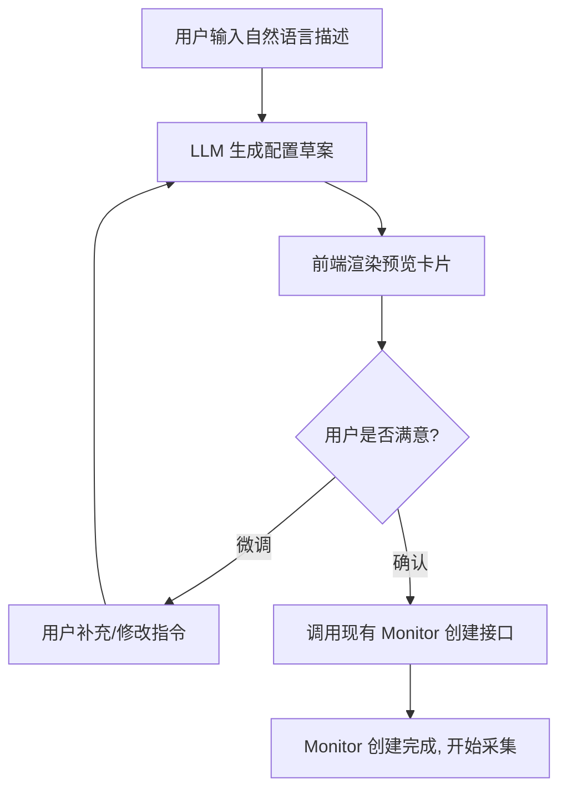
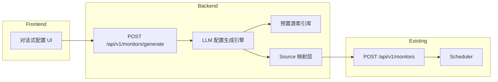
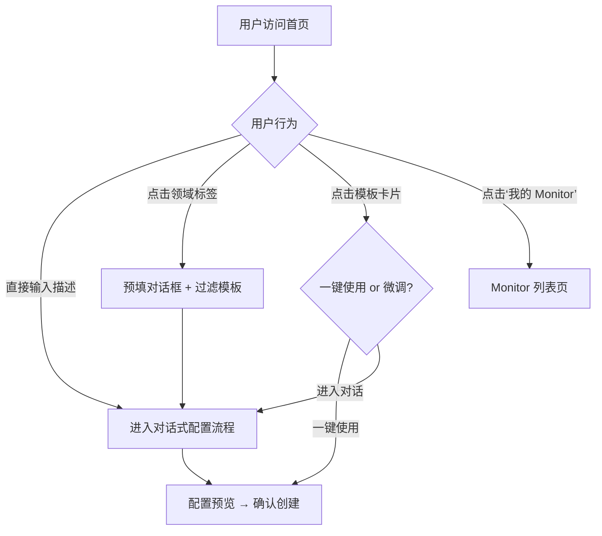

## 1) 背景与动机

Insight Flow 当前创建 Monitor 任务需要用户手动选择信息源、配置采集周期，这对不熟悉某领域的用户来说存在较高的认知门槛。

**核心问题：** 用户知道自己想关注什么领域，但不知道该订阅哪些具体信息源。

**解决思路：** 提供一个对话式交互界面，用户用自然语言描述关注方向，系统自动生成结构化的 Monitor 配置草案，包含推荐的信息源、关键词和调度策略。

---

## 2) 核心功能定义

用户输入一段自然语言描述后，系统生成一份 **Monitor 配置草案**，包含以下模块：

| 配置模块 | 说明 | 示例 |
| --- | --- | --- |
| **公司/项目 Blog** | 该领域核心公司或项目的官方博客 RSS | OpenAI Blog、LangChain Blog、Anthropic Research、CrewAI Blog |
| **X（Twitter）账号** | 领域内高影响力的 X 账号推荐 | @OpenAI、@LangChainAI、@AnthropicAI、@llaboratory |
| **Reddit 社区** | 相关的 Subreddit 推荐 | r/AI_Agents、r/LangChain、r/LocalLLaMA |
| **论文查找关键词** | 用于 ArXiv / Semantic Scholar 等学术源的检索词 | `"AI agent"`, `"agentic workflow"`, `"tool-use LLM"`, `"multi-agent"` |
| **采集周期与频率** | 根据领域节奏智能推荐调度策略 | 日报 / 周报 / 每周一三五 |

---

## 3) 用户交互流程



### 交互要点

- **第一轮：** LLM 根据描述生成完整配置草案，前端以卡片形式展示各模块
- **多轮微调：** 用户可以通过对话追加需求（如"加上 Hugging Face 动态""频率改成每周"）
- **确认创建：** 用户点击确认后，配置映射为实际 Monitor + Source 绑定

---

## 4) 完整交互示例

以下以「跟踪 Agent 前沿动态」为例，演示用户从输入描述到 Monitor 创建完成的完整流程。

### 第一轮：用户描述意图

> **用户输入：** "我想跟踪 Agent 领域的最前沿内容"
> 

系统调用 LLM 生成配置草案，前端渲染为以下预览卡片：

<aside>
📰

**公司/项目 Blog（4 个）**

- ● OpenAI Blog — `https://openai.com/blog/rss` — GPT、Agent SDK 等核心能力发布
- ● LangChain Blog — `https://blog.langchain.dev/rss` — LangGraph 等 Agent 编排框架更新
- ● Anthropic Research — `https://anthropic.com/research/rss` — Claude、MCP 等 Agent 基础设施研究
- ● CrewAI Blog — `https://www.crewai.com/blog/rss` — 多 Agent 编排框架动态

● = 系统已有源，● = 待添加

</aside>

<aside>
🐦

**X（Twitter）账号（4 个）**

- @OpenAI — GPT / Agent SDK 等核心能力发布源
- @LangChainAI — LangGraph 等 Agent 编排框架官方
- @AnthropicAI — Claude / MCP 等 Agent 基础设施
- @llaboratory — Agent 研究与前沿讨论活跃账号
</aside>

<aside>
💬

**Reddit 社区（3 个）**

- r/AI_Agents — Agent 专属社区，覆盖框架、应用与研究
- r/LangChain — LangChain / LangGraph 讨论
- r/LocalLLaMA — 本地 Agent 与模型部署讨论活跃
</aside>

<aside>
📄

**论文查找关键词**

`AI agent` · `agentic workflow` · `tool-use LLM` · `multi-agent system` · `LLM orchestration`

</aside>

<aside>
⏰

**采集策略：日报 · 每日推送**

Agent 领域迭代极快，建议日报跟踪前沿动态。

</aside>

### 第二轮：用户微调

> **用户输入：** "再加上 Hugging Face 和 AutoGPT 的动态，论文关键词补一个 'agent evaluation'，频率改成工作日就行"
> 

系统基于上一轮草案进行增量更新，前端高亮变更部分：

<aside>
📰

**公司/项目 Blog（6 个）** +2

- ● OpenAI Blog
- ● LangChain Blog
- ● Anthropic Research
- ● CrewAI Blog
- ● **Hugging Face Blog** — `https://huggingface.co/blog/feed.xml` — 开源模型与 Agent 生态 新增
- ● **AutoGPT Blog** — `https://news.agpt.co/feed/` — 自主 Agent 框架动态 新增
</aside>

<aside>
🐦

**X（Twitter）账号（6 个）** +2

- @OpenAI · @LangChainAI · @AnthropicAI · @llaboratory
- **@huggingface** — 开源模型与 Agent 工具链 新增
- **@Auto_GPT** — AutoGPT / Forge 自主 Agent 生态 新增
</aside>

<aside>
📄

**论文查找关键词** +1

`AI agent` · `agentic workflow` · `tool-use LLM` · `multi-agent system` · `LLM orchestration` · **`agent evaluation`** 新增

</aside>

<aside>
⏰

**采集策略：日报 · 工作日推送** 已调整

Agent 领域迭代极快；用户偏好工作日接收，避免周末打扰。

</aside>

### 第三轮：用户确认创建

> **用户点击「确认创建」按钮**
> 

系统执行以下操作：

1. 将草案中 `matched_source_id` 不为空的源直接绑定到新 Monitor
2. 将 `matched_source_id: null` 的源尝试自动发现并创建（RSS 验证 → 入库）
3. 调用 `POST /api/v1/monitors` 创建 Monitor，配置调度策略为工作日日报
4. 返回创建成功状态，展示 Monitor 概览卡片

<aside>
✅

**Monitor「Agent 前沿动态」已创建成功！**

- 已绑定 **2** 个现有源，**4** 个新源创建中
- 采集频率：工作日 · 日报
- 首次报告预计于明日 9:00 送达
</aside>

### 异常场景补充

| 场景 | 系统行为 | 用户感知 |
| --- | --- | --- |
| 用户描述过于模糊（如"帮我关注一些有意思的东西"） | LLM 反问引导，要求用户补充领域方向 | 对话追问："您希望关注哪个领域呢？比如 AI、Web3、产品设计…" |
| 推荐的 RSS 源无法访问 | Source 映射层验证失败，标记为 不可用 | 卡片上该源显示红色标记，提示"该源暂时无法采集，是否移除？" |
| 用户想加入系统不支持的源类型（如微信公众号） | LLM 识别后提示当前不支持，建议替代方案 | "微信公众号暂不支持直接采集，建议使用 RSS 桥接服务或关注其同步的 Blog" |
| 用户多轮修改后配置冲突（如同时要求日报+月报） | LLM 检测冲突并主动澄清 | "您之前选择了日报，现在又提到月报，请问是替换还是同时创建两个 Monitor？" |

---

## 5) 技术架构设计

### 4.1 整体架构



### 4.2 新增模块职责

| 模块 | 职责 | 位置 |
| --- | --- | --- |
| **LLM 配置生成引擎** | 接收用户描述，输出结构化配置 JSON（含推荐源、关键词、调度策略） | `backend/app/generators/monitor_generator.py` |
| **预置源索引库** | 维护已知高质量信息源的结构化索引（名称、URL、类型、领域标签） | `backend/app/generators/source_index.py` |
| **Source 映射层** | 将 LLM 推荐的逻辑源名称映射为系统内可采集的 Source 记录 | `backend/app/generators/source_mapper.py` |
| **对话式配置 UI** | 前端对话组件，支持预览配置卡片和多轮微调 | `frontend/src/components/monitor-generator/` |

### 4.3 API 设计

**生成配置草案**

```
POST /api/v1/monitors/generate
```

Request:

```json
{
  "description": "我想跟踪 Agent 领域的最前沿内容",
  "conversation_id": "optional-for-multi-turn",
  "refinement": "再加上 Hugging Face 和 CrewAI 的动态"
}
```

Response:

```json
{
  "conversation_id": "conv_xxx",
  "draft": {
    "name": "Agent 前沿动态",
    "blogs": [
      { "name": "OpenAI Blog", "url": "https://openai.com/blog/rss", "matched_source_id": 8 },
      { "name": "LangChain Blog", "url": "https://blog.langchain.dev/rss", "matched_source_id": 12 },
      { "name": "Anthropic Research", "url": "https://anthropic.com/research/rss", "matched_source_id": null },
      { "name": "CrewAI Blog", "url": "https://www.crewai.com/blog/rss", "matched_source_id": null }
    ],
    "x_accounts": [
      { "handle": "@OpenAI", "reason": "GPT / Agent SDK 等核心能力发布源" },
      { "handle": "@LangChainAI", "reason": "LangGraph 等 Agent 编排框架官方" },
      { "handle": "@AnthropicAI", "reason": "Claude / MCP 等 Agent 基础设施" },
      { "handle": "@llaboratory", "reason": "Agent 研究与前沿讨论活跃账号" }
    ],
    "reddit_communities": [
      { "subreddit": "r/AI_Agents", "reason": "Agent 专属社区，覆盖框架、应用与研究" },
      { "subreddit": "r/LangChain", "reason": "LangChain / LangGraph 讨论" },
      { "subreddit": "r/LocalLLaMA", "reason": "本地 Agent 与模型部署讨论活跃" }
    ],
    "paper_keywords": [
      "AI agent",
      "agentic workflow",
      "tool-use LLM",
      "multi-agent system",
      "LLM orchestration"
    ],
    "schedule": {
      "report_type": "daily",
      "frequency": "every_day",
      "reason": "Agent 领域迭代极快，建议日报跟踪前沿动态"
    }
  }
}
```

**确认创建**

```
POST /api/v1/monitors/generate/confirm
```

将草案转化为实际的 Monitor + Source 创建请求，复用现有 `POST /api/v1/monitors` 接口。

---

## 5) 预置源索引库设计

索引库是 LLM 推荐准确性的关键。

### 数据结构

```json
{
  "source_key": "langchain-blog",
  "display_name": "LangChain Blog",
  "type": "rss",
  "url": "https://blog.langchain.dev/rss/",
  "domains": ["ai-agent", "llm-framework", "langchain"],
  "description": "LangChain 官方博客，涵盖框架更新、最佳实践和社区案例",
  "internal_source_id": 12
}
```

### 索引策略

- **初期：** 手动维护高质量源（约 200-500 条），覆盖 AI/ML、开源、安全等热门领域
- **中期：** 支持用户贡献源 → 审核 → 入库
- **长期：** 自动发现（爬虫 + LLM 评估质量 + 自动入库）

### LLM 使用方式

1. 将用户描述 + 索引库摘要作为 context 送入 LLM
2. LLM 优先从索引库中匹配推荐
3. 索引库中无匹配时，LLM 可推荐外部源并标记 `matched_source_id: null`（需后续手动或自动添加）

---

## 6) 周期与频率的智能推荐策略

| 领域特征 | 推荐报告类型 | 推荐频率 | 理由 |
| --- | --- | --- | --- |
| 快速迭代的开源项目 | 日报 | 每日 | 版本发布和讨论频繁，需要及时跟踪 |
| 学术论文 / 研究进展 | 周报 | 每周一 | 论文发布节奏较慢，周报足够覆盖 |
| 行业政策 / 监管动态 | 周报 | 每周一 | 政策变化频率低，周报汇总更高效 |
| 竞品监控 | 日报 | 每日 / 工作日 | 需要及时感知竞品动态 |
| 社区热点 / 舆情 | 日报 | 每日 | 社交媒体信息衰减快，需日级捕获 |

LLM 生成配置时会结合用户描述推断领域特征，自动匹配上述策略，并在 `schedule.reason` 中给出推荐理由。

---

## 7) 前端 UI 设计要点

### 对话式配置组件

- **输入区域：** 类 Chat 输入框，支持多轮对话
- **配置预览卡片：** 每次 LLM 返回后渲染为结构化卡片
    - Blog 源列表（带匹配状态标识）
    - X 账号列表（带推荐理由）
    - Reddit 社区列表
    - 论文关键词标签
    - 调度策略卡片（含推荐理由）
- **操作按钮：** "确认创建" / "继续调整"
- **状态指示：** 未匹配到系统内源的项目标记为 待添加，已匹配的标记为 已就绪

### 入口位置

对话式 Monitor 配置作为产品首页的核心交互，同时在 Monitor 列表页保留 **"智能创建"** 入口。

### 首页设计方案

参考 Yutori Scouts 的设计语言，将对话式配置作为首页 Hero 区域的核心元素，降低用户启动门槛。

#### 页面布局（从上到下）

**① Hero 区域 — 品牌标语 + 核心对话框**

- 居中展示品牌标语，如：**"Monitor the web. Stay ahead."** 或中文版本 **"监控全网信息，让洞察先人一步。"**
- 下方居中放置大尺寸对话输入框，带 placeholder 轮播引导：

| Placeholder 示例 | 覆盖场景 |
| --- | --- |
| "跟踪 Agent 领域的最前沿内容..." | 技术前沿 |
| "监控竞品 XX 的产品发布与用户反馈..." | 竞品监控 |
| "关注 Rust 生态的每周进展..." | 开源项目 |
| "收集 AI 安全与对齐的最新论文..." | 学术研究 |
| "监测行业政策与监管动态..." | 行业政策 |
- 输入框右侧可放置发送按钮或 AI 图标，暗示"对话式"交互
- 输入框下方放置引导文案：**"不确定要关注什么？浏览热门模板 ↓"**

**② 领域快捷标签栏**

- 横向滚动标签，点击后预填对话框内容或直接触发配置生成
- 推荐标签：`AI / Agent` · `开源项目` · `学术论文` · `竞品监控` · `行业政策` · `社区热点` · `产品发布` · `安全漏洞`
- 第一个标签为 **"全部"**，不进行预填，显示下方所有模板卡片
- 点击其他标签后，下方模板卡片过滤为该领域的模板

**③ 热门 Monitor 模板卡片**

- 以网格/卡片形式展示 6-9 个推荐模板
- 每张卡片包含：
    - 模板名称（如"Agent 前沿动态""Rust 生态周报"）
    - 简短描述（1 行）
    - 包含的源类型图标（Blog · X · Reddit · 论文）
    - 推荐频率标签（日报 / 周报）
- 用户点击卡片后的行为：
    - **一键使用：** 直接进入配置预览页，可确认或微调
    - **进入对话：** 将模板描述预填到对话框，用户可进一步自定义

**④ 已有 Monitor 快捷入口（登录后可见）**

- 登录用户在 Hero 区域下方额外展示一行：**"我的 Monitor（N 个活跃）→"**
- 点击跳转到 Monitor 列表页 / Dashboard

#### 交互状态流转



#### 与 Yutori 的关键差异点

| 维度 | Yutori Scouts | Insight Flow |
| --- | --- | --- |
| **输入方式** | 单次输入，直接创建 | 多轮对话，渐进式完善配置 |
| **配置透明度** | 黑箱——用户不知道具体监控了哪些源 | 白箱——展示具体的 Blog、X、Reddit、论文关键词，用户可逐项调整 |
| **源状态** | 无可见状态 | 已就绪 / 待添加 / 不可用 状态可视化 |
| **模板体系** | 分类标签，但模板内容较简单 | 模板包含完整的源推荐 + 采集策略，可一键使用或进入对话微调 |
| **登录用户体验** | 无差异 | 登录后首页额外展示“我的 Monitor”快捷入口 |

#### Placeholder 轮播实现策略

- 轮播间隔：3-4 秒，带淡入淡出动画
- 当用户点击 / 聚焦输入框时，停止轮播，清空 placeholder，等待用户输入
- 轮播内容可后台配置，后续可基于用户历史做个性化推荐

---

## 8) 实现路线图

### Phase 1 — MVP（1-2 周）

- [ ]  实现 `POST /api/v1/monitors/generate` 接口（单轮生成）
- [ ]  搭建预置源索引库基础结构（手动维护 50-100 条高质量源）
- [ ]  LLM Prompt 工程：输入描述 → 输出结构化配置 JSON
- [ ]  前端基础对话 UI + 配置预览卡片
- [ ]  确认后调用现有 Monitor 创建接口

### Phase 2 — 多轮对话 + 源映射（1-2 周）

- [ ]  支持多轮对话微调配置（conversation_id 状态管理）
- [ ]  Source 映射层：LLM 推荐源 → 系统内 Source 自动匹配
- [ ]  未匹配源的自动创建流程（RSS 自动发现 + 验证）
- [ ]  扩充预置源索引库至 200+ 条

### Phase 3 — 智能增强（2-3 周）

- [ ]  基于用户历史 Monitor 的个性化推荐
- [ ]  源质量评分与排序
- [ ]  自动发现新源（定期爬取 + LLM 评估）
- [ ]  用户贡献源 → 审核 → 入库流程

---

## 9) 开放问题

- [ ]  **X 账号采集能力：** 当前 collectors 是否支持 X/Twitter 数据源？如不支持，需评估接入方案（API / RSS bridge / 浏览器 Agent）
- [ ]  **Reddit 采集能力：** 是否已有 Reddit RSS 采集器？Reddit 官方 RSS 格式为 `https://www.reddit.com/r/{subreddit}/new/.rss`
- [ ]  **论文源接入：** ArXiv RSS / Semantic Scholar API 的采集器是否就绪？
- [ ]  **LLM 选型：** 配置生成使用哪个模型？需权衡成本与推荐质量
- [ ]  **预置源索引库的初始数据从哪来？** 可考虑从现有 Source 表 + 人工补充