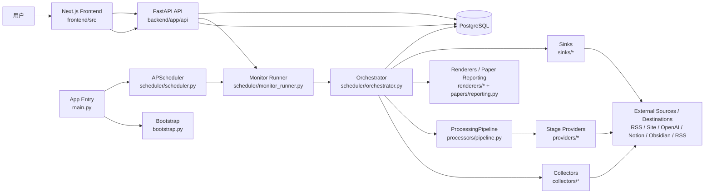
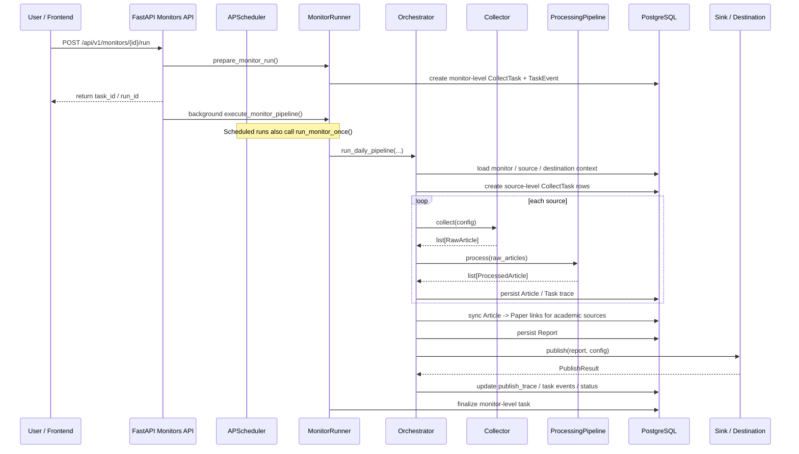
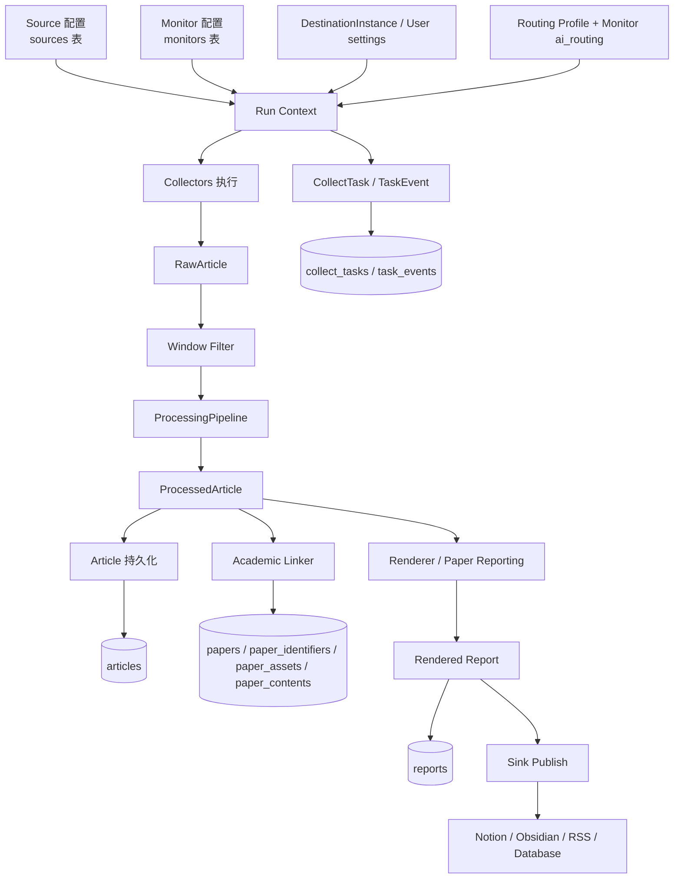
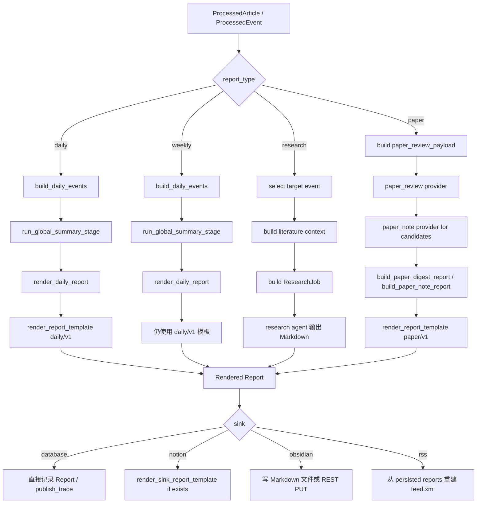
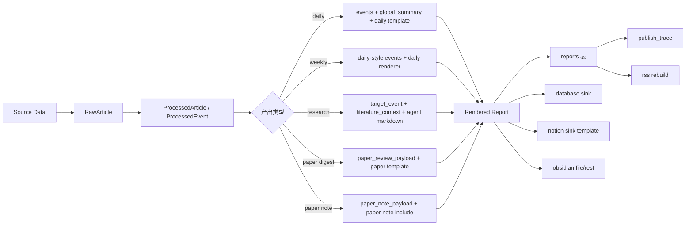
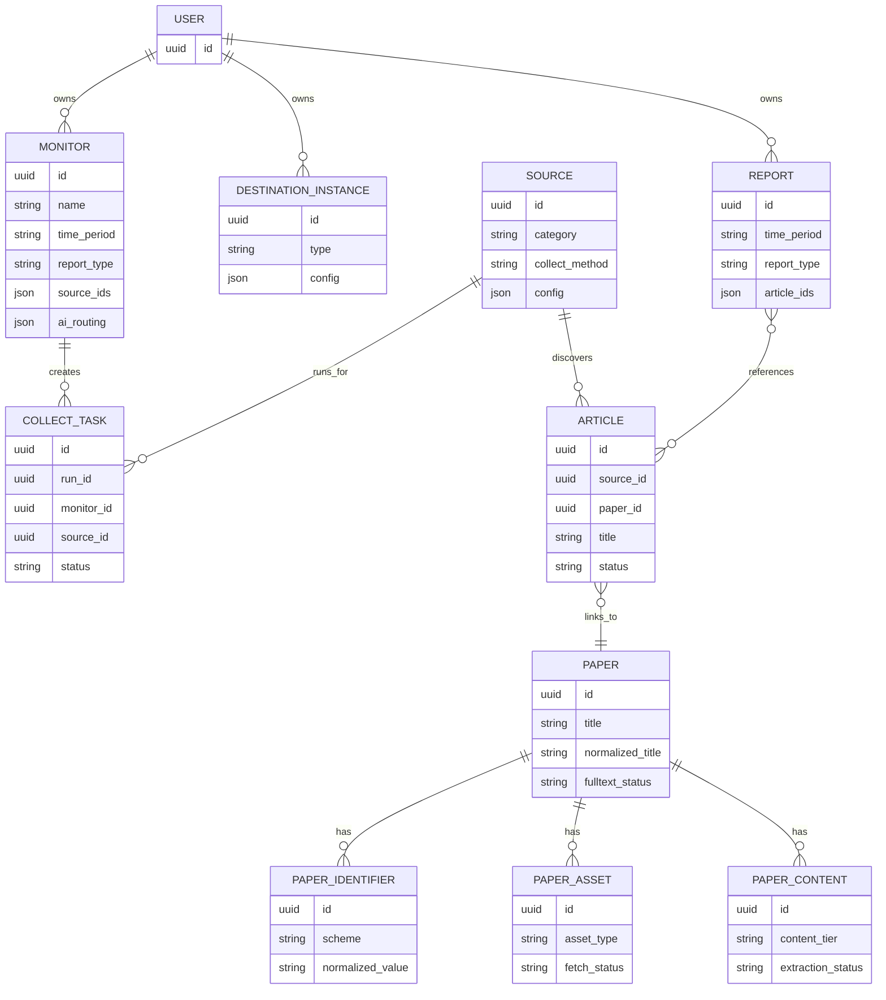

# Insight Flow 代码架构导读

这份文档面向准备进入 Insight Flow 进行开发的工程师，重点解决三件事：

- 快速建立整个项目的目录与职责心智模型
- 重点讲清楚后端架构、核心数据结构和一次任务执行的真实链路
- 让你知道改某一类功能时，应该优先读哪些文件、改哪些模块

如果你是第一次进入仓库，建议结合下面几份内容一起看：

- `README.md`
- `docs/development/architecture.mdx`
- `docs/development/collector-plugin.mdx`
- `docs/plans/`
- `backend/app/`
- `frontend/src/lib/api.ts`

## 1. 项目整体定位

Insight Flow 本质上不是一个“单次爬虫脚本”，也不是一个“纯报表页面”，而是一个配置驱动的异步研究工作台：

- 用户在前端配置信息源 `Source`
- 用户把多个信息源组合成监控任务 `Monitor`
- 后端调度器按 monitor 粒度执行
- 编排器并发采集、筛选、提炼、生成报告
- 结果落到数据库并发布到外部目标

可以先把系统理解成这样一条主线：

```text
配置层
  Source / Monitor / Provider / Destination
      ->
执行层
  Scheduler / MonitorRunner / Orchestrator
      ->
处理层
  Collector / ProcessingPipeline / Renderer / Sink
      ->
存储与展示层
  PostgreSQL / API / Frontend
```

## 2. 仓库结构总览

### 2.1 顶层目录

- `backend/`: FastAPI 后端、调度器、采集器、AI 流水线、报告生成、投递逻辑
- `frontend/`: Next.js 前端管理台
- `agents/`: 浏览器与研究代理相关能力
- `docs/`: 文档站、开发说明、设计与实现记录

### 2.2 最重要的代码目录

后端主要集中在 `backend/app/`：

- `api/`: REST API
- `scheduler/`: monitor 调度和运行编排
- `collectors/`: 信息源采集器
- `processors/`: 采集后加工流水线
- `providers/`: 各 stage 的规则/模型执行器
- `renderers/`: 报告渲染器
- `sinks/`: 报告投递目标
- `models/`: SQLAlchemy 模型
- `schemas/`: Pydantic 请求/响应模型
- `papers/`: 论文模式相关子系统
- `routing/`: AI 路由 profile
- `template_engine/` 和 `templates/`: 模板系统

前端主要集中在 `frontend/src/`：

- `app/`: 页面入口
- `components/`: 组件
- `lib/api.ts`: 前端唯一 API 调用入口
- `hooks/`: 交互逻辑

## 3. 整体框架图

下面这张图适合先建立“系统是怎么拼起来的”这个第一印象。



## 4. 后端架构分层

后端是这个项目的核心。最重要的理解方式不是按文件树逐个看，而是按“职责层”看。

### 4.1 入口与运行时层

关键文件：

- `backend/app/main.py`
- `backend/app/bootstrap.py`
- `backend/app/config.py`

职责：

- 创建 FastAPI 应用
- 注册 API 路由
- 管理生命周期
- 启动时同步运行时必要数据
- 启动 APScheduler
- 读取环境配置

#### `main.py`

`main.py` 做的事情很直接：

1. 创建 FastAPI app
2. 注册 CORS
3. 挂载 `/api`
4. 提供 `/health`
5. 在 lifespan 中执行 bootstrap 和 scheduler 初始化

重点是这段执行顺序：

```text
app startup
  -> bootstrap_runtime_data()
  -> init_scheduler()
```

这意味着应用启动不是“只把 HTTP 服务拉起来”，而是顺带做一轮运行时对齐。

#### `bootstrap.py`

这里负责：

- 确保默认用户存在
- 从 `collectors/source_presets.yaml` 读取预置源
- 推导每个预置源的 `collect_method` 和 `config`
- 同步到 `sources` 表
- 兼容历史字段和旧配置格式

要点：

- 预置源不是一次性 seed，而是启动时同步
- source preset 只是输入，真正生效的是 `_infer_collect_method()` 生成的 collector 配置
- 站点 profile 缺失时会自动构造兜底 profile，避免启动不可用

#### `config.py`

配置优先级：

```text
环境变量 > config.yaml > 代码默认值
```

主要配置域：

- App
- Database
- Redis
- LLM / Codex
- Scheduler
- Collector
- Browser
- Processor
- Sink
- Routing
- Research agents

### 4.2 API 层

关键文件：

- `backend/app/api/router.py`
- `backend/app/api/v1/*.py`
- `backend/app/schemas/*.py`

职责：

- 暴露 REST 接口
- 参数校验
- 资源 CRUD
- 触发 monitor 执行
- 查询运行日志、报告和配置

当前主要资源：

- `sources`
- `monitors`
- `articles`
- `reports`
- `tasks`
- `users`
- `destinations`
- `providers`
- `feed`

#### API 的设计特点

1. API 层比较薄  
   复杂业务不堆在 route handler 中，而是下放给 `monitor_runner`、`orchestrator`、`destinations/instances.py` 等模块。

2. API 版本统一走 `/api/v1/`  
   这符合仓库中的约束，前端也默认按这套路径调用。

3. 响应结构与前端强耦合  
   一旦后端 schema 改了，`frontend/src/lib/api.ts` 通常也要同步改。

### 4.3 调度与运行编排层

关键文件：

- `backend/app/scheduler/scheduler.py`
- `backend/app/scheduler/monitor_runner.py`
- `backend/app/scheduler/orchestrator.py`
- `backend/app/scheduler/task_events.py`

这是后端最核心的一层。

#### `scheduler.py`

功能：

- 为每个启用的 monitor 注册一个 APScheduler job
- 应用启动时同步所有 monitor job
- monitor 创建/更新/删除/禁用时，立即增删改对应 job

重要设计：

- job 粒度是 monitor，不是全局 daily sweep
- job id 格式为 `monitor:<uuid>`
- 调度执行时会重新查数据库拿最新 monitor，不依赖内存缓存

#### `monitor_runner.py`

职责分两部分：

1. 准备执行
2. 收尾更新状态

核心函数：

- `prepare_monitor_run()`
- `execute_monitor_pipeline()`
- `run_monitor_once()`

你可以把它理解为“monitor 级控制器”。

它负责：

- 创建本次 run 的 monitor-level `CollectTask`
- 计算 `run_id`
- 归一化 source / destination / window / overrides
- 调用 `Orchestrator.run_daily_pipeline()`
- 根据执行结果更新任务状态和阶段 trace

#### `orchestrator.py`

这是整个项目后端最值得花时间读的文件。它负责把下面这些事情串起来：

- 读取 monitor 上下文
- 并发采集多个 source
- 过滤与加工 raw article
- 持久化 article
- 建立 article -> paper 关系
- 生成 report
- 投递到 sink
- 写入 task event 与 publish trace

后面会单独展开它的执行链路。

### 4.4 采集层

关键文件：

- `backend/app/collectors/base.py`
- `backend/app/collectors/registry.py`
- `backend/app/collectors/*.py`
- `backend/app/collectors/site_profiles/*.yaml`

#### Collector 抽象

所有 collector 都遵循同一个基类契约：

- 输入：`config`
- 输出：`list[RawArticle]`

`RawArticle` 是采集层统一数据结构，字段很少：

- `external_id`
- `title`
- `url`
- `content`
- `published_at`
- `metadata`

这说明 collector 的职责非常明确：

- 它只负责抓原始信息并归一化
- 不做持久化
- 不做报告生成
- 不直接处理最终 UI 展示结构

#### 注册机制

collector 使用插件注册表：

- `@register("rss")`
- `@register("blog_scraper")`
- `@register("github_trending")`

运行时通过 `get_collector(name)` 拿实例。

这意味着：

- 新增 collector 不需要改核心调度接口
- 只要遵守 `BaseCollector` + registry 装饰器即可接入

### 4.5 加工层

关键文件：

- `backend/app/processors/pipeline.py`
- `backend/app/processors/window_filter.py`
- `backend/app/processors/candidate_cluster.py`
- `backend/app/processors/global_summary.py`
- `backend/app/processors/paper_review_stage.py`
- `backend/app/processors/paper_note_stage.py`

这一层处理的是“采集之后、渲染之前”的语义加工。

#### `ProcessingPipeline`

标准流程：

1. filter stage
2. candidate cluster stage
3. keywords stage

输出结构是 `ProcessedArticle`，比 `RawArticle` 多出很多报告所需字段：

- `summary`
- `keywords`
- `importance`
- `detail`
- `category`
- `event_title`
- `who / what / when`
- `metrics`
- `availability`
- `unknowns`
- `evidence`

这层的定位不是全文报告生成，而是“把原始内容加工成可用于渲染和聚合的结构化中间结果”。

### 4.6 Provider 与 Routing 层

关键文件：

- `backend/app/providers/base.py`
- `backend/app/providers/registry.py`
- `backend/app/providers/filter.py`
- `backend/app/providers/keywords.py`
- `backend/app/providers/report.py`
- `backend/app/providers/llm_chat.py`
- `backend/app/providers/codex_transport.py`
- `backend/app/routing/schema.py`
- `backend/app/routing/loader.py`

#### 为什么要有 Provider 层

因为项目里的 AI 行为不是硬编码在某个 stage 里的。

系统真正想表达的是：

- `filter` 是一个阶段
- `keywords` 是一个阶段
- `report` 是一个阶段

但每个阶段可以由不同 provider 执行：

- `rule`
- `llm_openai`
- `llm_codex`

所以 provider 是“阶段执行器”，而不是简单的模型 client。

#### Routing Profile

`RoutingProfile` 会定义每个 stage：

- primary provider
- fallback providers
- publish targets

运行时又会叠加 monitor 级 `ai_routing`，形成最终的 runtime routing。

### 4.7 渲染层

关键文件：

- `backend/app/renderers/base.py`
- `backend/app/renderers/daily.py`
- `backend/app/renderers/weekly.py`
- `backend/app/renderers/paper.py`
- `backend/app/template_engine/*`
- `backend/app/templates/*`

职责：

- 把结构化加工结果转换为 Markdown/HTML 报告
- 通过模板统一不同报告类型的输出格式

这里有两个重要概念：

- `RenderContext`
- `Report`

渲染器关注的不是“如何采集”，而是“最终以什么结构和模板输出”。

### 4.8 Sink 投递层

关键文件：

- `backend/app/sinks/base.py`
- `backend/app/sinks/registry.py`
- `backend/app/sinks/database.py`
- `backend/app/sinks/notion.py`
- `backend/app/sinks/obsidian.py`
- `backend/app/sinks/rss.py`
- `backend/app/destinations/instances.py`

职责：

- 接收已经生成的 `Report`
- 按目标配置发布到对应外部系统
- 返回发布结果和 trace

当前 sink 分两类：

- 内部 sink：`database`
- 外部 sink：`notion`、`obsidian`、`rss`

`destinations/instances.py` 则负责把用户配置的目标实例解析成运行时投递配置。

## 5. 后端一次 monitor 运行的完整执行链路

这一部分最重要。真正理解这个项目，关键就是把这条链路串起来。

## 5.1 时序图



## 5.2 入口：手动触发

手动运行入口在：

- `backend/app/api/v1/monitors.py`

接口：

- `POST /api/v1/monitors/{monitor_id}/run`

执行过程：

1. 读取 monitor
2. 调用 `prepare_monitor_run()`
3. 立即返回 `task_id` 和 `run_id`
4. 用 `BackgroundTasks` 异步执行 `execute_monitor_pipeline()`

这套设计的好处是：

- HTTP 不会被长任务阻塞
- 前端可以立刻进入轮询状态
- 后台执行失败也能通过任务与事件表回看

## 5.3 入口：定时触发

定时触发在：

- `backend/app/scheduler/scheduler.py`

应用启动时会：

1. 创建 APScheduler
2. 从数据库加载所有启用的 monitor
3. 按 monitor 生成 job

一个启用的 monitor 对应一个 job：

```text
job id = monitor:<monitor_uuid>
```

job 执行时会调用：

- `run_scheduled_monitor()`
- 再调用 `run_monitor_once(..., trigger_type="scheduled")`

## 5.4 `prepare_monitor_run()` 在做什么

`prepare_monitor_run()` 是 monitor 执行的起点。

它会：

- 清理过期 task event
- 更新 `monitor.last_run`
- 创建 monitor-level `CollectTask`
- 分配本次 `run_id`
- 写入 `run_started` 事件

这里最关键的是：它先把“这次 run 已经存在”这件事持久化下来，再开始真正业务执行。

## 5.5 `execute_monitor_pipeline()` 在做什么

这是进入 orchestrator 前的一层 monitor 级归一化。

它会准备：

- `source_ids`
- `destination_ids`
- `window_hours`
- `default_source_max_items`
- `source_overrides`
- `monitor_ai_routing`
- `paper_time_period`

然后实例化：

- `Orchestrator(max_concurrency=settings.collector_max_concurrency)`

最后调用：

- `run_daily_pipeline(...)`

注意 `run_daily_pipeline` 这个命名虽然带 daily，但实际上承担了 monitor 主执行入口职责，不只是日报。

## 5.6 Orchestrator 主流程拆解

### 阶段 1：加载运行上下文

Orchestrator 会先加载：

- 这次 run 关联的 source
- 用户 destination 配置
- 用户 provider 配置
- monitor AI routing
- routing profile
- 时间窗口

这个阶段决定了：

- 本次 run 处理哪些 source
- AI 每个 stage 用哪个 provider
- 要发布到哪些 sink

### 阶段 2：为每个 source 预创建任务记录

对每个 source 先写一条 `CollectTask`：

- `status = pending`
- `source_id = 当前 source`
- `run_id = 当前 monitor run`

这样做的目的不是业务逻辑必须，而是为了可观测性：

- 前端可以立即展示 source 级运行列表
- 后续每个 source 的状态变化都有落点

### 阶段 3：并发采集

核心函数：

- `collect_source()`

行为：

- 用 semaphore 限制并发
- 按 `fallback_chain` 逐个尝试 collector
- 每次尝试都生成 stage trace
- 成功就结束，失败则继续 fallback

典型路径：

```text
rss
  -> 如果失败，fallback 到 blog_scraper
  -> 如果仍失败，fallback 到 deepbrowse
```

### 阶段 4：时间窗口过滤与 pipeline 加工

采集完成后会：

1. 给 raw article 注入 `source_id`、`source_name`、`source_category`
2. 执行时间窗口过滤
3. 调用 `_process_source_articles()`

`_process_source_articles()` 内部会新建 `ProcessingPipeline` 并执行：

1. `run_filter_stage()`
2. `run_candidate_cluster_stage()`
3. `run_keywords_stage()`

最终输出 `ProcessedArticle`。

### 阶段 5：落库与学术论文关联

加工后的文章会被持久化为 `Article`。

如果 source 的 `category == "academic"`，还会调用：

- `papers/service.py::sync_article_paper_link()`

这一步会做：

- 从 metadata 里提取 DOI / arXiv / PMID / PMCID
- 标题规范化
- 查找是否已有 canonical `Paper`
- 如果没有则创建 `Paper`
- 建立 `Article.paper_id`
- 补充 `PaperIdentifier`

也就是说：

- `Article` 仍然是 source 视角的发现记录
- `Paper` 才是全局 canonical 论文实体

### 阶段 6：生成报告

普通报告模式：

- `daily`
- `weekly`
- `research`

这几类主要走 renderer + template 路线。

论文模式：

- `paper`

这类会走 `backend/app/papers/reporting.py`：

- `build_paper_digest_report()`
- `build_paper_note_report()`

因此论文链路不是普通日报的简单变体，而是项目里单独发展出来的一条专用子系统。

### 阶段 7：发布与收尾

报告生成后，orchestrator 会：

- 写入 `reports` 表
- 为每个 destination 解析 sink
- 构造 sink config
- 执行 `publish()`
- 记录 `publish_trace`
- 回写任务状态和事件

如果某个目标发布失败，不会只丢一条日志，而是进入结构化 trace，供前端展示和后续重试。

## 6. 数据流程图

这张图专门说明“配置如何变成运行产物”。



## 7. 产出透明化：模板、加工路径与最终产物

这一章专门回答你刚才关心的问题：

- 不同类型产出是不是都讲清楚了？
- 哪些模板真的在主链路里生效？
- 哪些模板文件只是“存在于仓库里”，但当前没有执行入口？
- 最终用户看到的一份报告，究竟经过了几次变换？

先给结论：

- `daily` 是当前最完整、最透明的模板链路
- `paper` 是当前最复杂、但也相对完整的专用链路
- `research` 当前是“agent 直接生成 Markdown”，不是标准模板渲染链路
- `weekly` 当前并没有走专用 `weekly` renderer/template，而是沿用 daily 聚合链路再落成 `report_type=weekly`
- `brief`、`deep_report`、部分子模板文件当前存在，但未接入 monitor 主输出链路

### 7.1 模板注册与模板解析的真实机制

模板系统的入口有 3 个关键文件：

- `backend/app/templates/manifest.yaml`
- `backend/app/template_engine/resolver.py`
- `backend/app/template_engine/renderer.py`

`manifest.yaml` 声明了当前默认版本：

- `daily -> v1`
- `weekly -> v1`
- `research -> v1`
- `paper -> v1`
- `notion` sink 对上述类型也各有 `v1`

但需要注意一个非常关键的实现事实：

- `resolver.py` 的 `resolve_report_template()` 只按 `reports/<report_type>/<version>.md.j2` 解析顶层模板
- 它不会自动解析 `daily/brief`、`daily/deep`、`paper/note` 这类更深层子路径

所以模板目录里“有文件”不等于“当前运行路径一定会走到它”。

### 7.2 模板生效矩阵

下面这张表是当前实现的真实状态，不是期望状态。

| 产出类型 | 主执行入口 | 主中间态 | 主模板入口 | sink 二次模板 | 当前状态 |
| --- | --- | --- | --- | --- | --- |
| `daily` | `orchestrator._render_and_persist_reports()` | `report_events` + `GlobalSummary` + `daily_report.metadata` | `reports/daily/v1.md.j2` | Notion: `sinks/notion/reports/daily/v1.md.j2` | 已完整接入 |
| `weekly` | `orchestrator._render_and_persist_reports()` | 与 `daily` 相同，先构建 daily-style events | 实际仍走 `render_daily_report()`，不是 `WeeklyRenderer` | Notion: `sinks/notion/reports/weekly/v1.md.j2` 存在，但上游不是 weekly renderer | 部分接入，实际为 daily 路径伪装成 weekly |
| `research` | `orchestrator._build_research_reports()` | `target_event` + `literature_context` + `ResearchJob` + agent 输出 | 当前直接使用 agent 产出的 Markdown，未调用 `reports/research/v1.md.j2` | Notion: `sinks/notion/reports/research/v1.md.j2` | 已产出，但不是标准模板链路 |
| `paper digest` | `orchestrator._build_paper_reports()` | `paper_review_payload` + digest metadata + note links | `reports/paper/v1.md.j2` | Notion: `sinks/notion/reports/paper/v1.md.j2` | 已完整接入 |
| `paper note` | `orchestrator._build_paper_reports()` | `paper_note_payload` + parent link + paper metadata | 通过 `reports/paper/v1.md.j2` include `reports/paper/note/v1.md.j2` | 通过 `sinks/notion/reports/paper/v1.md.j2` include `.../paper/note/v1.md.j2` | 已完整接入 |
| `brief` | `renderers/brief.py` | top items / overview | `reports/daily/v1.md.j2`，不是 `daily/brief/v1.md.j2` | `sinks/notion/reports/daily/brief/v1.md.j2` 存在 | 代码存在，但未接入主链路 |
| `deep_report` | `renderers/deep_report.py` | 无完整中间态 | 无实际渲染调用 | 无主链路使用 | stub |

这张表里最值得特别注意的 4 件事：

1. `weekly` 模板文件存在，但当前 orchestrator 并没有调用 `WeeklyRenderer`。
2. `research` 模板文件存在，但当前 research 报告直接使用 agent 输出 Markdown。
3. `brief` 和 `daily/brief` 子模板都存在，但主 monitor 执行路径没有使用它们。
4. `paper/note` 子模板虽然不是顶层 `report_type`，但会通过 `paper/v1.md.j2` 的 `include` 进入最终输出。

### 7.3 模板加工总流程图

这张图只讲“报告内容是怎么从中间态变成最终可发布文本”的。



### 7.4 `daily` 产出链路

`daily` 是当前最标准、最完整的模板化流程。

真实链路如下：

1. `processed_articles` 进入 `build_daily_events()`
2. daily renderer 事件聚合后生成 `events`
3. 运行 `run_global_summary_stage()`
4. `render_daily_report()` 把 `events + summary + overview` 组装成 `Report`
5. `render_report_template(report_type="daily", version="v1")`
6. 写入 `reports` 表
7. 进入各 sink 的 publish 流程

`daily` 的模板上下文主要包括：

- `date`
- `summary`
- `overview`
- `events`

`daily` 的最终 `Report.metadata` 里会包含：

- `events`
- `categories`
- `global_tldr`
- `tldr`
- `global_tldr_source`
- `global_summary_provider`
- `global_summary_fallback_used`
- `global_summary_metrics`
- `report_provider`
- `monitor_id`
- `monitor_name`

这说明 `daily` 不仅产出最终 Markdown，还保留了比较完整的审计上下文。

### 7.5 `weekly` 的真实情况

这里必须讲清楚，因为它最容易让人误解。

仓库里确实有：

- `backend/app/renderers/weekly.py`
- `backend/app/templates/reports/weekly/v1.md.j2`

但当前 orchestrator 在 `report_type == "weekly"` 时：

- 只把 `time_period` 设成 `weekly`
- 后续仍然走 `build_daily_events()`
- 仍然走 `run_global_summary_stage()`
- 仍然走 `render_daily_report()`

也就是说当前 `weekly` 的真实行为是：

- 数据组织方式接近 daily
- 持久化时标记为 `report_type=weekly`
- 但没有调用 `WeeklyRenderer`
- `weekly/v1.md.j2` 当前不在主链路上

同时，`renderers/weekly.py` 当前实现返回的是空内容：

- `content=""`
- 注释标记为 `P1` 预留

所以文档必须把它定义为：

- `weekly` 产出“有功能入口”
- 但“没有形成专用模板渲染链路”

### 7.6 `research` 的真实情况

`research` 当前不是“模板渲染优先”，而是“agent 输出优先”。

真实链路：

1. 从 `report_events` 中选一个 `target_event`
2. 从 article / paper 体系构造 `literature_context`
3. 生成 `ResearchJob`
4. 调用 research agent
5. agent 直接返回：
   - `title`
   - `summary`
   - `content_markdown`
   - `sources`
   - `artifacts`
   - `confidence`
6. orchestrator 直接把 `content_markdown` 写入 `Report.content`

所以：

- `backend/app/templates/reports/research/v1.md.j2` 当前存在
- 但 research 主链路并没有调用 `render_report_template(report_type="research")`

这意味着 research 的透明化重点不在模板上下文，而在 agent 输入输出：

- 目标事件是谁
- 研究任务怎么构建
- 使用哪个 agent
- 文本输出了什么
- evidence coverage 如何统计

最终 `metadata_` 中会留下：

- `template="research"`
- `analysis_mode`
- `events`
- `event_ids`
- `global_tldr`
- `research_agent`
- `research_runtime`
- `research_assistant_id`
- `research_job_id`
- `research_sources`
- `research_confidence`
- `research_artifacts`
- `research_metrics`
- `monitor_id`
- `monitor_name`

### 7.7 `paper digest` 与 `paper note` 链路

`paper` 是当前最专用的一条产出线。

#### `paper digest`

真实链路：

1. academic `ProcessedArticle` 进入 `_build_paper_reports()`
2. 构造 `paper_review_payload_input`
3. 调用 `paper_review` provider
4. 产出 `review_payload`
5. 根据 `review_payload` 选出 note candidate
6. 生成 digest metadata
7. 调用 `build_paper_digest_report()`
8. `build_paper_digest_report()` 再调用 `render_report_template(report_type="paper")`

digest 模板上下文主要包括：

- `paper_mode="digest"`
- `title`
- `date`
- `summary`
- `frontmatter`
- `properties`
- `theme_groups`
- `papers`

最终 digest metadata 主要包括：

- `paper_mode`
- `paper_identity`
- `paper_slug`
- `paper_note_links`
- `global_tldr`
- `tldr`
- `papers`
- `properties`
- `frontmatter`
- `theme_groups`
- `selected_paper_identities`

#### `paper note`

真实链路：

1. 对每个 `note_candidate` 构造 `paper_note_payload_input`
2. 调用 `paper_note` provider
3. `build_paper_note_report()` 组装详细笔记上下文
4. `render_report_template(report_type="paper")`
5. 顶层 `paper/v1.md.j2` 根据 `paper_mode == "note"` include `reports/paper/note/v1.md.j2`

note 模板上下文主要包括：

- `paper_mode="note"`
- `title`
- `authors`
- `affiliations`
- `links`
- `summary`
- `contributions`
- `problem_statement`
- `motivation`
- `method_details`
- `experiments`
- `strengths`
- `limitations`
- `next_steps`
- `related_reading`
- `back_link`

这里和 `daily` 最大的不同是：

- `paper` 不是事件聚合模板
- 它是论文对象模板
- `digest` 和 `note` 共用顶层 `paper` report_type，但靠 `paper_mode` 决定模板分支

### 7.8 `brief`、`daily/deep` 与 `deep_report` 的真实状态

这些文件当前更像“已放入仓库的能力碎片”，不是 monitor 主链路的一部分。

仓库里存在：

- `renderers/brief.py`
- `templates/reports/daily/brief/v1.md.j2`
- `templates/reports/daily/deep/v1.md.j2`
- `renderers/deep_report.py`

但真实情况是：

- orchestrator 当前只显式实例化了 `DailyRenderer`
- 没有看到 `BriefRenderer` 被主执行链路调用
- `DeepReportRenderer` 当前返回空内容 stub
- `daily/brief` 与 `daily/deep` 子模板没有通过 `resolver.py` 的通用顶层路径进入主链路

因此它们在文档里应被标记为：

- 存在模板或 renderer
- 但不是当前 monitor 主输出链路

### 7.9 sink 二次加工链路

很多人会误以为“模板渲染一次就结束了”，实际上不对。

当前至少有两层内容变换：

1. 报告级模板渲染
2. sink 级二次变换

#### Notion

`NotionSink.publish()` 会做：

1. 读取 `report_type`、`report_date`、`metadata`
2. 调用 `render_sink_report_template()`，如果对应 sink 模板存在则使用
3. 否则 fallback 到 `report.content`
4. 再做内容归一化，例如：
   - 去除冗余标题
   - daily 缺 overview 时做补充
5. 最后转成 Notion blocks

当前 Notion sink 模板的真实状态：

- `daily/v1`: 基本透传 `{{ content }}`
- `research/v1`: 基本透传 `{{ content }}`
- `paper/v1`: 会根据 `paper_mode` 决定是否 include note 子模板

#### Obsidian

Obsidian 当前没有通用 sink 模板层，主要做：

- 文件名计算
- 本地写文件或 REST PUT
- 少量 paper 链接重写逻辑

但需要透明说明一个实现事实：

- Obsidian 的 paper 特化逻辑依赖 `report.level == "paper"`
- 当前 paper digest/note 实际输出 level 是 `L3` / `L4`

所以就当前代码而言，paper 专用目录和链接改写分支并不稳定地位于主路径上，至少不能像 daily/paper template 那样视为“已完全对齐的透明链路”。

#### RSS

RSS 不是拿 renderer 输出直接写出去，而是：

1. 从 `reports` 表读取最近报告
2. 重新组装 feed XML
3. 使用 `report.metadata_` 和 `report.content` 生成 summary / HTML content

所以 RSS 更像“基于 persisted report 的再分发”，不是第一次渲染现场。

### 7.10 最终产出审计链路图



### 7.11 文档层面的透明化结论

如果以后你要检查“某一类产出到底经过了哪些处理”，推荐按这个顺序查：

1. `orchestrator.py` 里对应 `report_type` 分支
2. 该类型是否真的调用某个 renderer / reporting helper
3. `render_report_template()` 是否真的被走到
4. 对应模板文件是否是顶层入口，还是仅被 include
5. sink 是否又做了一次模板化或内容重写
6. 最终 `Report.metadata_` 和 `publish_trace` 里记录了哪些审计字段

用这个顺序看，就不会把“仓库里有某个模板文件”误判成“这条链路已经在生产路径生效”。

## 8. 插件机制与扩展点

项目的很多能力都遵循“基类 + registry + 名称查找”的模式。

这是很关键的扩展规则。

### 7.1 Collector 扩展点

关键文件：

- `backend/app/collectors/base.py`
- `backend/app/collectors/registry.py`

要求：

- 继承 `BaseCollector`
- 实现 `name`
- 实现 `category`
- 实现 `collect(self, config) -> list[RawArticle]`
- 使用 `@register("your_name")`

适用场景：

- 新增一种源站抓取方式
- 接入新的 academic provider
- 接入新的社交平台采集

### 7.2 Provider 扩展点

关键文件：

- `backend/app/providers/base.py`
- `backend/app/providers/registry.py`

要求：

- 继承 `BaseStageProvider`
- 指定 `stage`
- 指定 `name`
- 实现 `run(payload, config)`
- 使用 `@register(stage="xxx", name="yyy")`

适用场景：

- 新增某个 AI stage 的执行器
- 替换某阶段的 rule/llm 实现

### 7.3 Sink 扩展点

关键文件：

- `backend/app/sinks/base.py`
- `backend/app/sinks/registry.py`

要求：

- 继承 `BaseSink`
- 实现 `name`
- 实现 `publish(report, config)`

适用场景：

- 新增新投递目标，如 Slack、飞书、邮件等

### 7.4 Renderer 扩展点

关键文件：

- `backend/app/renderers/base.py`

要求：

- 继承 `BaseRenderer`
- 实现 `level`
- 实现 `render()`

适用场景：

- 新增报告类型
- 改写报告结构

## 9. 学术论文子系统

这是后端里最容易被忽略、但也最需要单独理解的一块。

关键目录：

- `backend/app/papers/`
- `backend/app/models/paper.py`
- `backend/app/processors/paper_review_stage.py`
- `backend/app/processors/paper_note_stage.py`
- `backend/app/templates/reports/paper/`

### 8.1 为什么需要 Paper 层

因为 academic source 的天然特点是：

- 同一篇论文可能从多个 source 被发现
- source 返回的内容质量不一致
- 有的只有 metadata，有的有 abstract，有的能拿到 fulltext
- 后续需要围绕“论文本体”做全文下载、转换和分析

所以系统没有把所有东西都塞进 `Article`，而是做了两层抽象：

- `Article`: 某个 source 发现了什么
- `Paper`: 这篇论文在全局范围内的 canonical 实体

### 8.2 论文相关模型

- `Paper`
- `PaperIdentifier`
- `PaperAsset`
- `PaperContent`

职责划分：

- `Paper`: 论文主实体
- `PaperIdentifier`: DOI/arXiv 等外部标识
- `PaperAsset`: 下载得到的 PDF/XML/HTML 原始资产
- `PaperContent`: 转换后的结构化正文

### 8.3 论文报告链路

论文模式通常包含两种输出：

- digest：多论文综述
- note：单论文详细笔记

对应核心函数：

- `build_paper_digest_report()`
- `build_paper_note_report()`

如果你后面要改 paper report，不要只看模板文件，至少要同时看：

- `papers/reporting.py`
- `papers/service.py`
- `models/paper.py`
- `templates/reports/paper/*`

## 10. 核心数据模型关系

下面这张图帮助你理解“配置对象、运行对象、内容对象、学术对象”之间的关系。



## 11. 配置类对象和运行类对象怎么区分

这是读表结构时最容易混的地方。

### 10.1 配置类对象

- `Source`
- `Monitor`
- `DestinationInstance`
- `User`

特点：

- 生命周期长
- 主要由前端配置页面维护
- 决定后端后续每次 run 的行为

### 10.2 运行类对象

- `CollectTask`
- `TaskEvent`

特点：

- 每次运行都会新增
- 用来追踪状态、trace、错误
- 是前端“运行中 / 历史日志 / 可观测性”页面的数据来源

### 10.3 内容类对象

- `Article`
- `Report`

特点：

- 由执行流程产生
- 是采集和报告输出的核心结果

### 10.4 学术增强对象

- `Paper`
- `PaperIdentifier`
- `PaperAsset`
- `PaperContent`

特点：

- 只在 academic 链路中有意义
- 为 canonical paper、全文获取和深度分析服务

## 12. 前端如何对接后端

关键文件：

- `frontend/src/lib/api.ts`
- `frontend/src/app/monitors/page.tsx`
- `frontend/src/app/reports/[id]/page.tsx`
- `frontend/src/app/destinations/page.tsx`
- `frontend/src/app/sources/page.tsx`

### 11.1 前端结构特点

前端更像一个资源管理台，而不是很重的业务编排层。

主要页面：

- `/`: 报告首页
- `/monitors`: 任务管理
- `/library`: 报告归档
- `/sources`: 信息源管理
- `/providers`: 模型配置
- `/destinations`: 输出配置

### 11.2 前后端接口耦合点

最关键的约束：

- `frontend/src/lib/api.ts` 是前端唯一 API 入口

所以你改后端接口时，至少同步检查：

1. `backend/app/schemas/*.py`
2. `backend/app/api/v1/*.py`
3. `frontend/src/lib/api.ts`
4. 依赖对应资源类型的页面组件

高频联动对象：

- `Monitor`
- `Source`
- `Report`
- `Provider`
- `Destination`

## 13. 阅读源码的推荐顺序

如果你现在主要做后端开发，推荐按这条顺序读：

1. `backend/app/main.py`
2. `backend/app/bootstrap.py`
3. `backend/app/api/router.py`
4. `backend/app/api/v1/monitors.py`
5. `backend/app/scheduler/monitor_runner.py`
6. `backend/app/scheduler/orchestrator.py`
7. `backend/app/processors/pipeline.py`
8. `backend/app/providers/`
9. `backend/app/models/`
10. `backend/app/papers/`
11. `backend/app/sinks/`
12. `backend/app/renderers/`

如果你主要做前端联调，推荐按这条顺序读：

1. `frontend/src/lib/api.ts`
2. `frontend/src/app/monitors/page.tsx`
3. `frontend/src/app/reports/[id]/page.tsx`
4. `frontend/src/app/destinations/page.tsx`
5. `frontend/src/app/sources/page.tsx`

## 14. 常见开发场景与落点

### 13.1 新增一个信息源采集方式

优先看：

- `backend/app/collectors/base.py`
- `backend/app/collectors/registry.py`
- 现有同类 collector
- `backend/app/collectors/source_presets.yaml`

### 13.2 改某个 AI 阶段的行为

优先看：

- `backend/app/processors/pipeline.py`
- `backend/app/providers/<stage>.py`
- `backend/app/prompts/`
- `backend/app/routing/loader.py`

### 13.3 新增一个输出目标

优先看：

- `backend/app/sinks/base.py`
- `backend/app/sinks/registry.py`
- `backend/app/destinations/instances.py`
- `backend/app/api/v1/destinations.py`
- `frontend/src/app/destinations/*`
- `frontend/src/lib/api.ts`

### 13.4 调整论文报告链路

优先看：

- `backend/app/papers/`
- `backend/app/models/paper.py`
- `backend/app/processors/paper_review_stage.py`
- `backend/app/processors/paper_note_stage.py`
- `backend/app/templates/reports/paper/`

### 13.5 改 monitor 调度和执行逻辑

优先看：

- `backend/app/scheduler/scheduler.py`
- `backend/app/scheduler/monitor_runner.py`
- `backend/app/scheduler/orchestrator.py`
- `docs/plans/2026-03-19-monitor-per-job-scheduling-design.md`

## 15. docs/plans 为什么值得读

这个仓库的 `docs/plans/` 不是简单备忘录，而是理解“为什么这样设计”的重要入口。

尤其建议看：

- `docs/plans/2026-03-19-monitor-per-job-scheduling-design.md`
- `docs/plans/2026-03-19-academic-paper-data-model-design.md`

这两份文件分别解释了：

- 为什么调度粒度改成 per-monitor job
- 为什么 article 之上又要叠一层 canonical paper 数据模型

如果你对某段实现感到“写法怪但似乎有原因”，先去搜对应 design 文件，通常比直接猜实现动机更快。

## 16. 最后用一句话概括后端

Insight Flow 后端可以概括为：

一个以 monitor 为调度单位、以 source 为采集单位、以 provider routing 为 AI 执行策略、以 report 与 sink 为输出终点的异步内容处理系统。

你真正要反复读熟的主线只有一条：

```text
main.py
  -> monitors API / scheduler
  -> monitor_runner
  -> orchestrator
  -> collector
  -> processing pipeline
  -> renderer / paper reporting
  -> sink publish
  -> article / report / task / paper persistence
```

只要这条主线建立起来，再去看单个 collector、单个 provider、单个 report type，就不会迷路。
